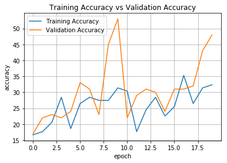

# Gesture Recognition using CNN
In this group project, we are build a 3D Conv model that will be able to predict the 5 gestures correctly.


```python
# Importing basic libraries to get started
import os
import datetime
import numpy as np

from skimage.io import imread
from skimage.util import crop
from skimage.transform import resize
import matplotlib.pyplot as plt
%matplotlib inline

import warnings
warnings.filterwarnings("ignore")
```


```python
np.random.seed(30)
import random as rn
rn.seed(30)
import tensorflow as tf
from keras import  backend as K

# Below command depends upon terraform version
# tf.random.set_seed(30)
tf.set_random_seed(30)
```

    Using TensorFlow backend.


```python
# Importing required Model libraries
from keras.models import Sequential, Model
from keras.layers import Dense, GRU, Flatten, TimeDistributed, Flatten, BatchNormalization, Activation, Dropout
from keras.layers.convolutional import Conv3D, MaxPooling3D
from keras.callbacks import ModelCheckpoint, ReduceLROnPlateau, CSVLogger
from keras import optimizers
```

## Reading and Understanding Data

In this block, you read the folder names for training and validation. You also set the batch_size here. Note that you set the batch size in such a way that you are able to use the GPU in full capacity. You keep increasing the batch size until the machine throws an error.


```python
train_doc = np.random.permutation(open('Project_data/train.csv').readlines())
val_doc   = np.random.permutation(open('Project_data/val.csv').readlines())
batch_size = 10

print("Size of  Training  Data", len(train_doc))
print("Size of Validation Data", len(val_doc))
```

    Size of  Training  Data 663
    Size of Validation Data 100


```python
image = imread("Project_data/train/WIN_20180907_15_35_09_Pro_Right Swipe_new/WIN_20180907_15_35_09_Pro_00022.png")
print(image.shape)

r_image = resize(image,(100,100,3))
r1_image = resize(image,(120,120,3))
c_image = crop(image, ((50, 100), (50, 50), (0,0)), copy=False)

fig, axes = plt.subplots(nrows=1, ncols=4)
fig.set_figwidth(15)
ax = axes.ravel()

ax[0].imshow(image, cmap='gray')
ax[0].set_title("Original image")

ax[1].imshow(r_image, cmap='gray')
ax[1].set_title("Resize image")

ax[2].imshow(r1_image, cmap='gray')
ax[2].set_title("Resize image x120")

ax[3].imshow(c_image, cmap='gray')
ax[3].set_title("Cropped image")
```

    (360, 360, 3)


    Text(0.5, 1.0, 'Cropped image')


```python
norm1_image = image/255
norm2_image = (image - np.min(image))/(np.max(image) - np.min(image))
norm3_image = (image - np.percentile(image,5))/ (np.percentile(image,95) - np.percentile(image,5))
norm4_image = (image - np.mean(image))/np.std(image)

fig, axes = plt.subplots(nrows=1, ncols=4)
fig.set_figwidth(15)
ax = axes.ravel()

ax[0].imshow(norm1_image, cmap='gray')
ax[0].set_title("Nomalisation/255")

ax[1].imshow(norm2_image, cmap='gray')
ax[1].set_title("Min-max Normalisation")

ax[2].imshow(norm3_image, cmap='gray')
ax[2].set_title("Percentile Normalisation")

ax[3].imshow(norm4_image, cmap='gray')
ax[3].set_title("Std-dev Mean Normalisation")
```

    Clipping input data to the valid range for imshow with RGB data ([0..1] for floats or [0..255] for integers).
    Clipping input data to the valid range for imshow with RGB data ([0..1] for floats or [0..255] for integers).


    Text(0.5, 1.0, 'Std-dev Mean Normalisation')


### Generator
This is one of the most important part of the code. The overall structure of the generator has been given. In the generator, you are going to preprocess the images as you have images of 2 different dimensions as well as create a batch of video frames. You have to experiment with img_idx, y,z and normalization such that you get high accuracy.


```python
# x is the number of images you use for each video, 
# (y,z) is the final size of the input images and 3 is the number of channels RGB
x = 30  # number of frames
y = 120 # image width
z = 120 # image height
classes = 5

# Generator for model sample.
def generator(source_path, folder_list, batch_size):
    print("source path = ",source_path, " batch size= ", batch_size)
    
    img_idx = [x for x in range(0,x)]
    while True:
        t = np.random.permutation( folder_list )

        # Calculate number of batches
        num_batches = int(len(folder_list)/batch_size)
        for batch in range(num_batches):
            batch_data  = np.zeros((batch_size,x,y,z,3))
            # batch_labels is the one hot representation of the output
            batch_labels= np.zeros((batch_size,classes)) 
            for folder in range(batch_size):
                # read all the images in the folder
                imgs = os.listdir(source_path+'/'+ t[folder + (batch*batch_size)].split(';')[0])
                for idx,item in enumerate(img_idx):
                    image = imread(source_path+'/'+ t[folder + (batch*batch_size)].strip().split(';')[0]+'/'+imgs[item]).astype(np.float32)
                    # crop the images and resize them. Note that the images are of 2 different shape 
                    #  and the conv3D will throw error if the inputs in a batch have different shapes
                    
                    temp = resize(image,(y,z,3))
                    #Converting to gray scale
                    temp = temp.mean(axis=-1,keepdims=1) 
                    temp = temp/127.5-1 #Normalize data
                    batch_data[folder,idx] = temp #normalise and feed in the image
#                     batch_data[folder,idx,:,:,0] = (image[:,:,0] - np.percentile(image[:,:,0],5))/ (np.percentile(image[:,:,0],95) - np.percentile(image[:,:,0],5))
#                     batch_data[folder,idx,:,:,1] = (image[:,:,1] - np.percentile(image[:,:,1],5))/ (np.percentile(image[:,:,1],95) - np.percentile(image[:,:,1],5))
#                     batch_data[folder,idx,:,:,2] = (image[:,:,2] - np.percentile(image[:,:,2],5))/ (np.percentile(image[:,:,2],95) - np.percentile(image[:,:,2],5))

                batch_labels[folder, int(t[folder + (batch*batch_size)].strip().split(';')[2])] = 1
            yield batch_data, batch_labels
        # code for remaining batches
        if (len(folder_list) != batch_size*num_batches):
            print("Batch: ",num_batches+1,"Index:", batch_size)
            batch_size = len(folder_list) - (batch_size*num_batches)
            batch_data = np.zeros((batch_size,x,y,z,3)) # x is the number of images you use for each video, (y,z) is the final size of the input images and 3 is the number of channels RGB
            batch_labels = np.zeros((batch_size,classes)) # batch_labels is the one hot representation of the output
            for folder in range(batch_size): # iterate over the batch_size
                imgs = os.listdir(source_path+'/'+ t[folder + (batch*batch_size)].split(';')[0]) # read all the images in the folder
                for idx,item in enumerate(img_idx): #  Iterate iver the frames/images of a folder to read them in
                    image = imread(source_path+'/'+ t[folder + (batch*batch_size)].strip().split(';')[0]+'/'+imgs[item]).astype(np.float32)
                    
                    temp = resize(image,(y,z))
                    #Converting to gray scale
                    temp = temp.mean(axis=-1,keepdims=1) 
                    temp = temp/127.5-1 #Normalize data
                    
                    batch_data[folder,idx] = temp

                batch_labels[folder, int(t[folder + (batch*batch_size)].strip().split(';')[2])] = 1
            yield batch_data, batch_labels
```

Note here that a video is represented above in the generator as (number of images, height, width, number of channels). Take this into consideration while creating the model architecture.


```python
curr_dt_time = datetime.datetime.now()
train_path = 'Project_data/train'
val_path   = 'Project_data/val'

num_train_sequences = len( train_doc )
num_val_sequences   = len( val_doc )
print('# training sequences   =', num_train_sequences)
print('# validation sequences =', num_val_sequences)
num_epochs = 10 #choose the number of epochs
print ('# epochs =', num_epochs)
```

    # training sequences   = 663
    # validation sequences = 100
    # epochs = 10


```python
# Importing Model Libraries
from keras.models import Sequential, Model
from keras.layers import Dense, GRU, Flatten, TimeDistributed, Flatten, BatchNormalization, Activation, Dropout
from keras.layers.convolutional import Conv3D, MaxPooling3D
from keras.callbacks import ModelCheckpoint, ReduceLROnPlateau
from keras import optimizers
import keras
```

### Sample model to start and modify along


```python
def print_input_parm():
    print('# epochs =', num_epochs)
    print('# batch size =', batch_size)
    print("Size of  Training  Data", len(train_doc))
    print("Size of Validation Data", len(val_doc))
    print("No of frames in train data", x)
    print("Height of Input image", y)
    print("Width  of Input image", z)
    
print_input_parm()
```

    # epochs = 10
    # batch size = 10
    Size of  Training  Data 663
    Size of Validation Data 100
    No of frames in train data 30
    Height of Input image 120
    Width  of Input image 120


### Model
Here you make the model using different functionalities that Keras provides. Remember to use Conv3D and MaxPooling3D and not Conv2D and Maxpooling2D for a 3D convolution model. You would want to use TimeDistributed while building a Conv2D + RNN model. Also remember that the last layer is the softmax. Design the network in such a way that the model is able to give good accuracy on the least number of parameters so that it can fit in the memory of the webcam.


```python
model_a = Sequential()

model_a.add(Conv3D(8, kernel_size=(3,3,3), input_shape=(x, y, z, 3), padding='same'))
model_a.add(BatchNormalization())
model_a.add(Activation('relu'))

model_a.add(MaxPooling3D(pool_size=(2,2,2)))

model_a.add(Conv3D(16, kernel_size=(3,3,3), padding='same'))
model_a.add(BatchNormalization())
model_a.add(Activation('relu'))

model_a.add(MaxPooling3D(pool_size=(2,2,2)))

model_a.add(Conv3D(32, kernel_size=(1,3,3), padding='same'))
model_a.add(BatchNormalization())
model_a.add(Activation('relu'))

model_a.add(MaxPooling3D(pool_size=(2,2,2)))

model_a.add(Conv3D(64, kernel_size=(1,3,3), padding='same'))
model_a.add(BatchNormalization())
model_a.add(Activation('relu'))

model_a.add(MaxPooling3D(pool_size=(2,2,2)))
#Flatten Layers
model_a.add(Flatten())

model_a.add(Dense(1000, activation='relu'))
model_a.add(Dropout(0.5))

model_a.add(Dense(500, activation='relu'))
model_a.add(Dropout(0.5))

#softmax layer
model_a.add(Dense(5, activation='softmax'))
```


```python
optimiser = optimizers.Adam(lr=0.001) #write your optimizer
model_a.compile(optimizer=optimiser, loss='categorical_crossentropy', metrics=['categorical_accuracy'])
print (model_a.summary())
```

    _________________________________________________________________
    Layer (type)                 Output Shape              Param #   
    =================================================================
    conv3d_1 (Conv3D)            (None, 30, 120, 120, 8)   656       
    _________________________________________________________________
    batch_normalization_1 (Batch (None, 30, 120, 120, 8)   32        
    _________________________________________________________________
    activation_1 (Activation)    (None, 30, 120, 120, 8)   0         
    _________________________________________________________________
    max_pooling3d_1 (MaxPooling3 (None, 15, 60, 60, 8)     0         
    _________________________________________________________________
    conv3d_2 (Conv3D)            (None, 15, 60, 60, 16)    3472      
    _________________________________________________________________
    batch_normalization_2 (Batch (None, 15, 60, 60, 16)    64        
    _________________________________________________________________
    activation_2 (Activation)    (None, 15, 60, 60, 16)    0         
    _________________________________________________________________
    max_pooling3d_2 (MaxPooling3 (None, 7, 30, 30, 16)     0         
    _________________________________________________________________
    conv3d_3 (Conv3D)            (None, 7, 30, 30, 32)     4640      
    _________________________________________________________________
    batch_normalization_3 (Batch (None, 7, 30, 30, 32)     128       
    _________________________________________________________________
    activation_3 (Activation)    (None, 7, 30, 30, 32)     0         
    _________________________________________________________________
    max_pooling3d_3 (MaxPooling3 (None, 3, 15, 15, 32)     0         
    _________________________________________________________________
    conv3d_4 (Conv3D)            (None, 3, 15, 15, 64)     18496     
    _________________________________________________________________
    batch_normalization_4 (Batch (None, 3, 15, 15, 64)     256       
    _________________________________________________________________
    activation_4 (Activation)    (None, 3, 15, 15, 64)     0         
    _________________________________________________________________
    max_pooling3d_4 (MaxPooling3 (None, 1, 7, 7, 64)       0         
    _________________________________________________________________
    flatten_1 (Flatten)          (None, 3136)              0         
    _________________________________________________________________
    dense_1 (Dense)              (None, 1000)              3137000   
    _________________________________________________________________
    dropout_1 (Dropout)          (None, 1000)              0         
    _________________________________________________________________
    dense_2 (Dense)              (None, 500)               500500    
    _________________________________________________________________
    dropout_2 (Dropout)          (None, 500)               0         
    _________________________________________________________________
    dense_3 (Dense)              (None, 5)                 2505      
    =================================================================
    Total params: 3,667,749
    Trainable params: 3,667,509
    Non-trainable params: 240
    _________________________________________________________________
    None


```python
# Let us create the train_generator and the val_generator which will be used in .fit_generator.
train_generator = generator(train_path, train_doc, batch_size)
val_generator = generator(val_path, val_doc, batch_size)
```


```python
model_name = 'model_init' + '_' + str(curr_dt_time).replace(' ','').replace(':','_') + '/'
    
if not os.path.exists(model_name):
    os.mkdir(model_name)
        
filepath = model_name + 'model-{epoch:05d}-{loss:.5f}-{categorical_accuracy:.5f}-{val_loss:.5f}-{val_categorical_accuracy:.5f}.h5'

checkpoint = ModelCheckpoint(filepath, monitor='val_loss', verbose=1, save_best_only=True, save_weights_only=False, mode='auto', period=1)

LR = ReduceLROnPlateau(monitor='val_loss', factor=0.5, patience=2, cooldown=1, verbose=1) # write the REducelronplateau code here
csv_logger = CSVLogger('training.log', append=True)
callbacks_list = [checkpoint, LR, csv_logger]
```

The steps_per_epoch and validation_steps are used by fit_generator to decide the number of next() calls it need to make.


```python
if (num_train_sequences%batch_size) == 0:
    steps_per_epoch = int(num_train_sequences/batch_size)
else:
    steps_per_epoch = (num_train_sequences//batch_size) + 1

if (num_val_sequences%batch_size) == 0:
    validation_steps = int(num_val_sequences/batch_size)
else:
    validation_steps = (num_val_sequences//batch_size) + 1
    
print("# Steps per epoch  ", steps_per_epoch)
print("# validation_steps ", validation_steps)
```

    # Steps per epoch   17
    # validation_steps  3


```python
model_s =model_a.fit_generator(train_generator, steps_per_epoch=steps_per_epoch, epochs=num_epochs, verbose=1, 
                    callbacks=callbacks_list, validation_data=val_generator, 
                    validation_steps=validation_steps, class_weight=None, workers=1, initial_epoch=0)
```

    source path =  Project_data/val  batch size=  10
    source path =  Project_data/train  batch size=  10
    Epoch 1/10
    65/67 [============================>.] - ETA: 4s - loss: 12.7953 - categorical_accuracy: 0.2062Batch:  67 Index: 10
    67/67 [==============================] - 141s 2s/step - loss: 12.6631 - categorical_accuracy: 0.2144 - val_loss: 12.7333 - val_categorical_accuracy: 0.2100
    
    Epoch 00001: val_loss improved from inf to 12.73330, saving model to model_init_2020-06-2811_24_17.579627/model-00001-12.73889-0.20965-12.73330-0.21000.h5
    Epoch 2/10
    67/67 [==============================] - 43s 636ms/step - loss: 12.6699 - categorical_accuracy: 0.2139 - val_loss: 12.7333 - val_categorical_accuracy: 0.2100
    
    Epoch 00002: val_loss did not improve from 12.73330
    Epoch 3/10
    67/67 [==============================] - 48s 718ms/step - loss: 12.5096 - categorical_accuracy: 0.2239 - val_loss: 12.7333 - val_categorical_accuracy: 0.2100
    
    Epoch 00003: val_loss did not improve from 12.73330
    
    Epoch 00003: ReduceLROnPlateau reducing learning rate to 0.0005000000237487257.
    Epoch 4/10
    67/67 [==============================] - 46s 680ms/step - loss: 12.7501 - categorical_accuracy: 0.2090 - val_loss: 12.7333 - val_categorical_accuracy: 0.2100
    
    Epoch 00004: val_loss did not improve from 12.73330
    Epoch 5/10
    67/67 [==============================] - 48s 713ms/step - loss: 13.4718 - categorical_accuracy: 0.1642 - val_loss: 12.7333 - val_categorical_accuracy: 0.2100
    
    Epoch 00005: val_loss did not improve from 12.73330
    
    Epoch 00005: ReduceLROnPlateau reducing learning rate to 0.0002500000118743628.
    Epoch 6/10
    67/67 [==============================] - 47s 706ms/step - loss: 12.2690 - categorical_accuracy: 0.2388 - val_loss: 12.7333 - val_categorical_accuracy: 0.2100
    
    Epoch 00006: val_loss did not improve from 12.73330
    Epoch 7/10
    67/67 [==============================] - 46s 684ms/step - loss: 12.9105 - categorical_accuracy: 0.1990 - val_loss: 12.7333 - val_categorical_accuracy: 0.2100
    
    Epoch 00007: val_loss did not improve from 12.73330
    
    Epoch 00007: ReduceLROnPlateau reducing learning rate to 0.0001250000059371814.
    Epoch 8/10
    67/67 [==============================] - 46s 688ms/step - loss: 12.8303 - categorical_accuracy: 0.2040 - val_loss: 12.7333 - val_categorical_accuracy: 0.2100
    
    Epoch 00008: val_loss improved from 12.73330 to 12.73330, saving model to model_init_2020-06-2811_24_17.579627/model-00008-12.83032-0.20398-12.73330-0.21000.h5
    Epoch 9/10
    67/67 [==============================] - 48s 712ms/step - loss: 13.0709 - categorical_accuracy: 0.1891 - val_loss: 12.7333 - val_categorical_accuracy: 0.2100
    
    Epoch 00009: val_loss did not improve from 12.73330
    
    Epoch 00009: ReduceLROnPlateau reducing learning rate to 6.25000029685907e-05.
    Epoch 10/10
    67/67 [==============================] - 44s 653ms/step - loss: 12.5096 - categorical_accuracy: 0.2239 - val_loss: 12.7333 - val_categorical_accuracy: 0.2100
    
    Epoch 00010: val_loss did not improve from 12.73330


```python
# visualise training history
# plt.plot(model_s.history['loss'],                     label='Categorical crossentropy (training data)')
# plt.plot(model_s.history['val_loss'],                 label='Categorical crossentropy (validation data)')
plt.plot(model_s.history['categorical_accuracy']    , label='Accuracy (training data)')
plt.plot(model_s.history['val_categorical_accuracy'], label='Accuracy (validation data)')
plt.title('model accuracy')
plt.ylabel('accuracy')
plt.xlabel('epoch')
plt.legend(loc="lower right")
plt.show()
```


### Model 2 - Change Architecture
Sample model shows improvement in Training Data but does not performed well on validation data, let try to change arcticture.
Change architecture as compared to Model 1

Changes:-
- Using multiple convolutional layers and then max pooling.


```python
from keras.losses import categorical_crossentropy
from keras.optimizers import Adam
channel=3
# Define model b
model_b = Sequential()
model_b.add(Conv3D(32, kernel_size=(3, 3, 3), input_shape=(x,y,z,channel), padding='same'))
model_b.add(Activation('relu'))
model_b.add(Conv3D(32, kernel_size=(3, 3, 3), padding='same'))
model_b.add(Activation('relu'))
model_b.add(MaxPooling3D(pool_size=(3, 3, 3), padding='same'))
model_b.add(Dropout(0.25))

model_b.add(Conv3D(64, kernel_size=(3, 3, 3), padding='same'))
model_b.add(Activation('relu'))
model_b.add(Conv3D(64, kernel_size=(3, 3, 3), padding='same'))
model_b.add(Activation('relu'))
model_b.add(MaxPooling3D(pool_size=(3, 3, 3), padding='same'))
model_b.add(Dropout(0.25))

model_b.add(Flatten())
model_b.add(Dense(512, activation='relu'))
model_b.add(Dropout(0.5))
model_b.add(Dense(classes, activation='softmax'))

model_b.compile(optimizer=Adam(), loss='categorical_crossentropy', metrics=['categorical_accuracy'])
model_b.summary()
```

    _________________________________________________________________
    Layer (type)                 Output Shape              Param #   
    =================================================================
    conv3d_5 (Conv3D)            (None, 30, 120, 120, 32)  2624      
    _________________________________________________________________
    activation_5 (Activation)    (None, 30, 120, 120, 32)  0         
    _________________________________________________________________
    conv3d_6 (Conv3D)            (None, 30, 120, 120, 32)  27680     
    _________________________________________________________________
    activation_6 (Activation)    (None, 30, 120, 120, 32)  0         
    _________________________________________________________________
    max_pooling3d_5 (MaxPooling3 (None, 10, 40, 40, 32)    0         
    _________________________________________________________________
    dropout_3 (Dropout)          (None, 10, 40, 40, 32)    0         
    _________________________________________________________________
    conv3d_7 (Conv3D)            (None, 10, 40, 40, 64)    55360     
    _________________________________________________________________
    activation_7 (Activation)    (None, 10, 40, 40, 64)    0         
    _________________________________________________________________
    conv3d_8 (Conv3D)            (None, 10, 40, 40, 64)    110656    
    _________________________________________________________________
    activation_8 (Activation)    (None, 10, 40, 40, 64)    0         
    _________________________________________________________________
    max_pooling3d_6 (MaxPooling3 (None, 4, 14, 14, 64)     0         
    _________________________________________________________________
    dropout_4 (Dropout)          (None, 4, 14, 14, 64)     0         
    _________________________________________________________________
    flatten_2 (Flatten)          (None, 50176)             0         
    _________________________________________________________________
    dense_4 (Dense)              (None, 512)               25690624  
    _________________________________________________________________
    dropout_5 (Dropout)          (None, 512)               0         
    _________________________________________________________________
    dense_5 (Dense)              (None, 5)                 2565      
    =================================================================
    Total params: 25,889,509
    Trainable params: 25,889,509
    Non-trainable params: 0
    _________________________________________________________________


```python
train_generator = generator(train_path, train_doc, batch_size)
val_generator = generator(val_path, val_doc, batch_size)
```


```python
model_2 = model_b.fit_generator(train_generator, steps_per_epoch=steps_per_epoch, epochs=num_epochs, verbose=1, 
                    callbacks=callbacks_list, validation_data=val_generator, 
                    validation_steps=validation_steps, class_weight=None, workers=1, initial_epoch=0)
```

    source path =  Project_data/val  batch size=  10
    source path =  Project_data/train  batch size=  10
    Epoch 1/10
    65/67 [============================>.] - ETA: 4s - loss: 1.7343 - categorical_accuracy: 0.2077Batch:  67 Index: 10
    67/67 [==============================] - 155s 2s/step - loss: 1.7305 - categorical_accuracy: 0.2060 - val_loss: 1.6013 - val_categorical_accuracy: 0.2300
    
    Epoch 00001: val_loss improved from 12.73330 to 1.60134, saving model to model_init_2020-06-2811_24_17.579627/model-00001-1.73182-0.20814-1.60134-0.23000.h5
    Epoch 2/10
    67/67 [==============================] - 50s 748ms/step - loss: 1.6087 - categorical_accuracy: 0.1891 - val_loss: 1.5673 - val_categorical_accuracy: 0.3600
    
    Epoch 00002: val_loss improved from 1.60134 to 1.56734, saving model to model_init_2020-06-2811_24_17.579627/model-00002-1.60872-0.18905-1.56734-0.36000.h5
    Epoch 3/10
    67/67 [==============================] - 51s 765ms/step - loss: 1.6098 - categorical_accuracy: 0.2388 - val_loss: 1.6096 - val_categorical_accuracy: 0.2100
    
    Epoch 00003: val_loss did not improve from 1.56734
    Epoch 4/10
    67/67 [==============================] - 52s 770ms/step - loss: 1.6120 - categorical_accuracy: 0.1891 - val_loss: 1.6082 - val_categorical_accuracy: 0.2100
    
    Epoch 00004: val_loss did not improve from 1.56734
    
    Epoch 00004: ReduceLROnPlateau reducing learning rate to 0.0005000000237487257.
    Epoch 5/10
    67/67 [==============================] - 51s 764ms/step - loss: 1.6105 - categorical_accuracy: 0.2090 - val_loss: 1.6084 - val_categorical_accuracy: 0.2100
    
    Epoch 00005: val_loss did not improve from 1.56734
    Epoch 6/10
    67/67 [==============================] - 54s 805ms/step - loss: 1.6076 - categorical_accuracy: 0.2189 - val_loss: 1.6094 - val_categorical_accuracy: 0.2100
    
    Epoch 00006: val_loss did not improve from 1.56734
    
    Epoch 00006: ReduceLROnPlateau reducing learning rate to 0.0002500000118743628.
    Epoch 7/10
    67/67 [==============================] - 52s 775ms/step - loss: 1.6121 - categorical_accuracy: 0.1343 - val_loss: 1.6089 - val_categorical_accuracy: 0.2100
    
    Epoch 00007: val_loss did not improve from 1.56734
    Epoch 8/10
    67/67 [==============================] - 52s 776ms/step - loss: 1.6072 - categorical_accuracy: 0.2338 - val_loss: 1.6086 - val_categorical_accuracy: 0.2100
    
    Epoch 00008: val_loss did not improve from 1.56734
    
    Epoch 00008: ReduceLROnPlateau reducing learning rate to 0.0001250000059371814.
    Epoch 9/10
    67/67 [==============================] - 53s 793ms/step - loss: 1.6073 - categorical_accuracy: 0.1841 - val_loss: 1.6085 - val_categorical_accuracy: 0.2100
    
    Epoch 00009: val_loss did not improve from 1.56734
    Epoch 10/10
    67/67 [==============================] - 52s 773ms/step - loss: 1.6094 - categorical_accuracy: 0.2090 - val_loss: 1.6085 - val_categorical_accuracy: 0.2100
    
    Epoch 00010: val_loss did not improve from 1.56734
    
    Epoch 00010: ReduceLROnPlateau reducing learning rate to 6.25000029685907e-05.


```python
plt.plot(model_2.history['categorical_accuracy']    , label='Accuracy (training data)')
plt.plot(model_2.history['val_categorical_accuracy'], label='Accuracy (validation data)')
plt.title('model accuracy')
plt.ylabel('accuracy')
plt.xlabel('epoch')
plt.legend(loc="lower right")
plt.show()
```


Again validation data becomes consistent after 2 runs only. Lets try to make changes to other parameter and see how it will impact using the same architecture.

### Model 3 - Changing Image Height and Width


```python
x = 30 # number of frames
y = 60 # image width
z = 60 # image height
channel=3
print_input_parm()
```

    # epochs = 10
    # batch size = 10
    Size of  Training  Data 663
    Size of Validation Data 100
    No of frames in train data 30
    Height of Input image 60
    Width  of Input image 60


```python
# Define model b
model_b = Sequential()
model_b.add(Conv3D(32, kernel_size=(3, 3, 3), input_shape=(x,y,z,channel), padding='same'))
model_b.add(Activation('relu'))
model_b.add(Conv3D(32, kernel_size=(3, 3, 3), padding='same'))
model_b.add(Activation('relu'))
model_b.add(MaxPooling3D(pool_size=(3, 3, 3), padding='same'))
model_b.add(Dropout(0.25))

model_b.add(Conv3D(64, kernel_size=(3, 3, 3), padding='same'))
model_b.add(Activation('relu'))
model_b.add(Conv3D(64, kernel_size=(3, 3, 3), padding='same'))
model_b.add(Activation('relu'))
model_b.add(MaxPooling3D(pool_size=(3, 3, 3), padding='same'))
model_b.add(Dropout(0.25))

model_b.add(Flatten())
model_b.add(Dense(512, activation='relu'))
model_b.add(Dropout(0.5))
model_b.add(Dense(classes, activation='softmax'))

model_b.compile(optimizer=keras.optimizers.Adam(), loss='categorical_crossentropy', metrics=['categorical_accuracy'])
model_b.summary()
```

    _________________________________________________________________
    Layer (type)                 Output Shape              Param #   
    =================================================================
    conv3d_1 (Conv3D)            (None, 30, 60, 60, 32)    2624      
    _________________________________________________________________
    activation_1 (Activation)    (None, 30, 60, 60, 32)    0         
    _________________________________________________________________
    conv3d_2 (Conv3D)            (None, 30, 60, 60, 32)    27680     
    _________________________________________________________________
    activation_2 (Activation)    (None, 30, 60, 60, 32)    0         
    _________________________________________________________________
    max_pooling3d_1 (MaxPooling3 (None, 10, 20, 20, 32)    0         
    _________________________________________________________________
    dropout_1 (Dropout)          (None, 10, 20, 20, 32)    0         
    _________________________________________________________________
    conv3d_3 (Conv3D)            (None, 10, 20, 20, 64)    55360     
    _________________________________________________________________
    activation_3 (Activation)    (None, 10, 20, 20, 64)    0         
    _________________________________________________________________
    conv3d_4 (Conv3D)            (None, 10, 20, 20, 64)    110656    
    _________________________________________________________________
    activation_4 (Activation)    (None, 10, 20, 20, 64)    0         
    _________________________________________________________________
    max_pooling3d_2 (MaxPooling3 (None, 4, 7, 7, 64)       0         
    _________________________________________________________________
    dropout_2 (Dropout)          (None, 4, 7, 7, 64)       0         
    _________________________________________________________________
    flatten_1 (Flatten)          (None, 12544)             0         
    _________________________________________________________________
    dense_1 (Dense)              (None, 512)               6423040   
    _________________________________________________________________
    dropout_3 (Dropout)          (None, 512)               0         
    _________________________________________________________________
    dense_2 (Dense)              (None, 5)                 2565      
    =================================================================
    Total params: 6,621,925
    Trainable params: 6,621,925
    Non-trainable params: 0
    _________________________________________________________________


```python
train_generator = generator(train_path, train_doc, batch_size)
val_generator = generator(val_path, val_doc, batch_size)
```


```python
model_3 = model_b.fit_generator(train_generator, steps_per_epoch=steps_per_epoch, epochs=num_epochs, verbose=1, 
                    callbacks=callbacks_list, validation_data=val_generator, 
                    validation_steps=validation_steps, class_weight=None, workers=1, initial_epoch=0)
```

    source path =  Project_data/val  batch size=  10
    source path =  Project_data/train Epoch 1/10 batch size=  10
    
    65/67 [============================>.] - ETA: 6s - loss: 1.6422 - categorical_accuracy: 0.2031Batch:  67 Index: 10
    67/67 [==============================] - 208s 3s/step - loss: 1.6413 - categorical_accuracy: 0.1985 - val_loss: 1.6070 - val_categorical_accuracy: 0.1800
    
    Epoch 00001: val_loss improved from inf to 1.60696, saving model to model_init_2020-06-2907_32_45.453379/model-00001-1.64164-0.20060-1.60696-0.18000.h5
    Epoch 2/10
    67/67 [==============================] - 36s 531ms/step - loss: 1.6111 - categorical_accuracy: 0.2040 - val_loss: 1.6125 - val_categorical_accuracy: 0.1600
    
    Epoch 00002: val_loss did not improve from 1.60696
    Epoch 3/10
    67/67 [==============================] - 34s 511ms/step - loss: 1.6056 - categorical_accuracy: 0.2488 - val_loss: 1.6109 - val_categorical_accuracy: 0.1700
    
    Epoch 00003: val_loss did not improve from 1.60696
    
    Epoch 00003: ReduceLROnPlateau reducing learning rate to 0.0005000000237487257.
    Epoch 4/10
    67/67 [==============================] - 37s 557ms/step - loss: 1.5331 - categorical_accuracy: 0.3134 - val_loss: 1.3953 - val_categorical_accuracy: 0.3900
    
    Epoch 00006: val_loss improved from 1.51322 to 1.39531, saving model to model_init_2020-06-2907_32_45.453379/model-00006-1.53314-0.31343-1.39531-0.39000.h5
    Epoch 7/10
    67/67 [==============================] - 36s 538ms/step - loss: 1.4673 - categorical_accuracy: 0.3632 - val_loss: 1.4697 - val_categorical_accuracy: 0.4400
    
    Epoch 00007: val_loss did not improve from 1.39531
    Epoch 8/10
    67/67 [==============================] - 36s 536ms/step - loss: 1.4833 - categorical_accuracy: 0.4179 - val_loss: 1.3587 - val_categorical_accuracy: 0.4500
    
    Epoch 00008: val_loss improved from 1.39531 to 1.35875, saving model to model_init_2020-06-2907_32_45.453379/model-00008-1.48334-0.41791-1.35875-0.45000.h5
    Epoch 9/10
    67/67 [==============================] - 36s 544ms/step - loss: 1.3797 - categorical_accuracy: 0.3980 - val_loss: 1.3006 - val_categorical_accuracy: 0.4200
    
    Epoch 00009: val_loss improved from 1.35875 to 1.30056, saving model to model_init_2020-06-2907_32_45.453379/model-00009-1.37969-0.39801-1.30056-0.42000.h5
    Epoch 10/10
    67/67 [==============================] - 35s 529ms/step - loss: 1.3237 - categorical_accuracy: 0.3881 - val_loss: 1.1884 - val_categorical_accuracy: 0.5400
    
    Epoch 00010: val_loss improved from 1.30056 to 1.18843, saving model to model_init_2020-06-2907_32_45.453379/model-00010-1.32368-0.38806-1.18843-0.54000.h5


```python
plt.plot(model_3.history['categorical_accuracy']    , label='Accuracy (training data)')
plt.plot(model_3.history['val_categorical_accuracy'], label='Accuracy (validation data)')
plt.title('model accuracy')
plt.ylabel('accuracy')
plt.xlabel('epoch')
plt.legend(loc="lower right")
plt.show()
```


Validation accuracy is more than training data which indicates weak training data. Lets increase batch size

### Model 4 - Changing Batch Size


```python
batch_size = 20
print_input_parm()

if (num_train_sequences%batch_size) == 0:
    steps_per_epoch = int(num_train_sequences/batch_size)
else:
    steps_per_epoch = (num_train_sequences//batch_size) + 1

if (num_val_sequences%batch_size) == 0:
    validation_steps = int(num_val_sequences/batch_size)
else:
    validation_steps = (num_val_sequences//batch_size) + 1
```

    # epochs = 10
    # batch size = 20
    Size of  Training  Data 663
    Size of Validation Data 100
    No of frames in train data 30
    Height of Input image 60
    Width  of Input image 60


```python
train_generator = generator(train_path, train_doc, batch_size)
val_generator   = generator(val_path, val_doc, batch_size)
```


```python
model_4 = model_b.fit_generator(train_generator, steps_per_epoch=steps_per_epoch, epochs=num_epochs, verbose=1, 
                    callbacks=callbacks_list, validation_data=val_generator, 
                    validation_steps=validation_steps, class_weight=None, workers=1, initial_epoch=0)
```

    Epoch 1/10
    34/34 [==============================] - 24s 695ms/step - loss: 0.9058 - categorical_accuracy: 0.6373 - val_loss: 0.8960 - val_categorical_accuracy: 0.6000
    
    Epoch 00001: val_loss improved from 0.94558 to 0.89605, saving model to model_init_2020-06-2907_32_45.453379/model-00001-0.90578-0.63725-0.89605-0.60000.h5
    Epoch 2/10
    34/34 [==============================] - 23s 687ms/step - loss: 0.8694 - categorical_accuracy: 0.6471 - val_loss: 0.9155 - val_categorical_accuracy: 0.6600
    
    Epoch 00002: val_loss did not improve from 0.89605
    Epoch 3/10
    34/34 [==============================] - 25s 730ms/step - loss: 0.7297 - categorical_accuracy: 0.6667 - val_loss: 0.9123 - val_categorical_accuracy: 0.6700
    
    Epoch 00003: val_loss did not improve from 0.89605
    
    Epoch 00003: ReduceLROnPlateau reducing learning rate to 6.25000029685907e-05.
    Epoch 4/10
    34/34 [==============================] - 25s 721ms/step - loss: 0.7290 - categorical_accuracy: 0.7059 - val_loss: 0.9280 - val_categorical_accuracy: 0.6400
    
    Epoch 00004: val_loss did not improve from 0.89605
    Epoch 5/10
    34/34 [==============================] - 23s 669ms/step - loss: 0.6511 - categorical_accuracy: 0.7353 - val_loss: 0.8757 - val_categorical_accuracy: 0.6400
    
    Epoch 00005: val_loss improved from 0.89605 to 0.87568, saving model to model_init_2020-06-2907_32_45.453379/model-00005-0.65105-0.73529-0.87568-0.64000.h5
    Epoch 6/10
    34/34 [==============================] - 23s 674ms/step - loss: 0.6312 - categorical_accuracy: 0.7255 - val_loss: 0.9240 - val_categorical_accuracy: 0.6700
    
    Epoch 00006: val_loss did not improve from 0.87568
    Epoch 7/10
    34/34 [==============================] - 24s 693ms/step - loss: 0.6329 - categorical_accuracy: 0.7745 - val_loss: 0.8706 - val_categorical_accuracy: 0.7200
    
    Epoch 00007: val_loss improved from 0.87568 to 0.87057, saving model to model_init_2020-06-2907_32_45.453379/model-00007-0.63291-0.77451-0.87057-0.72000.h5
    Epoch 8/10
    34/34 [==============================] - 23s 688ms/step - loss: 0.7187 - categorical_accuracy: 0.6863 - val_loss: 0.9549 - val_categorical_accuracy: 0.6500
    
    Epoch 00008: val_loss did not improve from 0.87057
    Epoch 9/10
    34/34 [==============================] - 23s 680ms/step - loss: 0.4901 - categorical_accuracy: 0.8039 - val_loss: 0.8332 - val_categorical_accuracy: 0.6900
    
    Epoch 00009: val_loss improved from 0.87057 to 0.83318, saving model to model_init_2020-06-2907_32_45.453379/model-00009-0.49012-0.80392-0.83318-0.69000.h5
    Epoch 10/10
    34/34 [==============================] - 23s 672ms/step - loss: 0.6965 - categorical_accuracy: 0.7059 - val_loss: 0.8802 - val_categorical_accuracy: 0.6800
    
    Epoch 00010: val_loss did not improve from 0.83318


```python
plt.plot(model_4.history['categorical_accuracy']    , label='Accuracy (training data)')
plt.plot(model_4.history['val_categorical_accuracy'], label='Accuracy (validation data)')
plt.title('model accuracy')
plt.ylabel('accuracy')
plt.xlabel('epoch')
plt.legend(loc="lower right")
plt.show()
```


Model shows good sign of improvement in increasing batch size. Lets increase a bit more batch size

### Model 5 - Chaning Batch Size to 30


```python
batch_size = 30
print_input_parm()

if (num_train_sequences%batch_size) == 0:
    steps_per_epoch = int(num_train_sequences/batch_size)
else:
    steps_per_epoch = (num_train_sequences//batch_size) + 1

if (num_val_sequences%batch_size) == 0:
    validation_steps = int(num_val_sequences/batch_size)
else:
    validation_steps = (num_val_sequences//batch_size) + 1
```

    # epochs = 10
    # batch size = 30
    Size of  Training  Data 663
    Size of Validation Data 100
    No of frames in train data 30
    Height of Input image 60
    Width  of Input image 60


```python
train_generator = generator(train_path, train_doc, batch_size)
val_generator   = generator(val_path, val_doc, batch_size)
```


```python
model_5 = model_b.fit_generator(train_generator, steps_per_epoch=steps_per_epoch, epochs=num_epochs, verbose=1, 
                    callbacks=callbacks_list, validation_data=val_generator, 
                    validation_steps=validation_steps, class_weight=None, workers=1, initial_epoch=0)
```

    source path =  Project_data/val  batch size=  30
    source path =  Project_data/train Epoch 1/10
     batch size=  30
     3/23 [==>...........................] - ETA: 2:12 - loss: 0.6464 - categorical_accuracy: 0.6889Batch:  4 Index: 30
    21/23 [==========================>...] - ETA: 9s - loss: 0.5797 - categorical_accuracy: 0.7794 Batch:  23 Index: 30
    23/23 [==============================] - 103s 4s/step - loss: 0.5805 - categorical_accuracy: 0.7668 - val_loss: 0.8870 - val_categorical_accuracy: 0.6700
    
    Epoch 00001: val_loss did not improve from 0.83318
    Epoch 2/10
    23/23 [==============================] - 12s 516ms/step - loss: 0.6169 - categorical_accuracy: 0.8116 - val_loss: 0.7961 - val_categorical_accuracy: 0.7250
    
    Epoch 00002: val_loss improved from 0.83318 to 0.79609, saving model to model_init_2020-06-2907_32_45.453379/model-00002-0.61693-0.81159-0.79609-0.72500.h5
    Epoch 3/10
    23/23 [==============================] - 14s 587ms/step - loss: 0.4847 - categorical_accuracy: 0.8696 - val_loss: 0.9782 - val_categorical_accuracy: 0.6750
    
    Epoch 00003: val_loss did not improve from 0.79609
    Epoch 4/10
    23/23 [==============================] - 13s 546ms/step - loss: 0.4175 - categorical_accuracy: 0.8696 - val_loss: 0.8528 - val_categorical_accuracy: 0.6750
    
    Epoch 00004: val_loss did not improve from 0.79609
    
    Epoch 00004: ReduceLROnPlateau reducing learning rate to 3.125000148429535e-05.
    Epoch 5/10
    23/23 [==============================] - 12s 539ms/step - loss: 0.5879 - categorical_accuracy: 0.7681 - val_loss: 0.8747 - val_categorical_accuracy: 0.7500
    
    Epoch 00005: val_loss did not improve from 0.79609
    Epoch 6/10
    23/23 [==============================] - 13s 563ms/step - loss: 0.6392 - categorical_accuracy: 0.7246 - val_loss: 0.9526 - val_categorical_accuracy: 0.6000
    
    Epoch 00006: val_loss did not improve from 0.79609
    
    Epoch 00006: ReduceLROnPlateau reducing learning rate to 1.5625000742147677e-05.
    Epoch 7/10
    23/23 [==============================] - 13s 582ms/step - loss: 0.6003 - categorical_accuracy: 0.7681 - val_loss: 0.8723 - val_categorical_accuracy: 0.6500
    
    Epoch 00007: val_loss did not improve from 0.79609
    Epoch 8/10
    23/23 [==============================] - 12s 537ms/step - loss: 0.6291 - categorical_accuracy: 0.7971 - val_loss: 0.8751 - val_categorical_accuracy: 0.6750
    
    Epoch 00008: val_loss did not improve from 0.79609
    
    Epoch 00008: ReduceLROnPlateau reducing learning rate to 7.812500371073838e-06.
    Epoch 9/10
    23/23 [==============================] - 14s 588ms/step - loss: 0.4479 - categorical_accuracy: 0.8261 - val_loss: 0.8732 - val_categorical_accuracy: 0.6250
    
    Epoch 00009: val_loss did not improve from 0.79609
    Epoch 10/10
    23/23 [==============================] - 13s 553ms/step - loss: 0.4755 - categorical_accuracy: 0.8406 - val_loss: 0.9514 - val_categorical_accuracy: 0.6250
    
    Epoch 00010: val_loss did not improve from 0.79609
    
    Epoch 00010: ReduceLROnPlateau reducing learning rate to 3.906250185536919e-06.


```python
plt.plot(model_5.history['categorical_accuracy']    , label='Accuracy (training data)')
plt.plot(model_5.history['val_categorical_accuracy'], label='Accuracy (validation data)')
plt.title('model accuracy')
plt.ylabel('accuracy')
plt.xlabel('epoch')
plt.legend(loc="lower right")
plt.show()
```


### Model 6 - Chaning Batch Size to 40
High batches are failing with OOM error. So need to stick with low batch size.


```python
batch_size = 40
print_input_parm()

if (num_train_sequences%batch_size) == 0:
    steps_per_epoch = int(num_train_sequences/batch_size)
else:
    steps_per_epoch = (num_train_sequences//batch_size) + 1

if (num_val_sequences%batch_size) == 0:
    validation_steps = int(num_val_sequences/batch_size)
else:
    validation_steps = (num_val_sequences//batch_size) + 1
```

    # epochs = 10
    # batch size = 40
    Size of  Training  Data 663
    Size of Validation Data 100
    No of frames in train data 30
    Height of Input image 60
    Width  of Input image 60


```python
train_generator = generator(train_path, train_doc, batch_size)
val_generator   = generator(val_path, val_doc, batch_size)
```


```python
model_6 = model_b.fit_generator(train_generator, steps_per_epoch=steps_per_epoch, epochs=num_epochs, verbose=1, 
                    callbacks=callbacks_list, validation_data=val_generator, 
                    validation_steps=validation_steps, class_weight=None, workers=1, initial_epoch=0)
```

    source path =  Project_data/val  batch size=  40
    source path =  Project_data/train Epoch 1/10
     batch size=  40
     2/17 [==>...........................] - ETA: 2:07 - loss: 0.5026 - categorical_accuracy: 0.7750Batch:  3 Index: 40
    15/17 [=========================>....] - ETA: 13s - loss: 0.5529 - categorical_accuracy: 0.7867Batch:  17 Index: 40
    17/17 [==============================] - 115s 7s/step - loss: 0.5479 - categorical_accuracy: 0.7893 - val_loss: 0.9053 - val_categorical_accuracy: 0.6100
    
    Epoch 00001: val_loss did not improve from 0.79609
    Epoch 2/10
    17/17 [==============================] - 54s 3s/step - loss: 0.5423 - categorical_accuracy: 0.8235 - val_loss: 0.9073 - val_categorical_accuracy: 0.6667
    
    Epoch 00002: val_loss did not improve from 0.79609
    Epoch 3/10
    10/17 [================>.............] - ETA: 24s - loss: 0.4896 - categorical_accuracy: 0.8348Batch:  29 Index: 23
    17/17 [==============================] - 55s 3s/step - loss: 0.5270 - categorical_accuracy: 0.7933 - val_loss: 0.7827 - val_categorical_accuracy: 0.6833
    
    Epoch 00003: val_loss improved from 0.79609 to 0.78271, saving model to model_init_2020-06-2907_32_45.453379/model-00003-0.52309-0.79837-0.78271-0.68333.h5
    Epoch 4/10
    17/17 [==============================] - 50s 3s/step - loss: 0.5200 - categorical_accuracy: 0.7740 - val_loss: 1.0034 - val_categorical_accuracy: 0.6333
    
    Epoch 00004: val_loss did not improve from 0.78271
    Epoch 5/10
    11/17 [==================>...........] - ETA: 17s - loss: 0.5460 - categorical_accuracy: 0.7847Batch:  35 Index: 19
    17/17 [==============================] - 49s 3s/step - loss: 0.5520 - categorical_accuracy: 0.7819 - val_loss: 0.9180 - val_categorical_accuracy: 0.5833
    
    Epoch 00005: val_loss did not improve from 0.78271
    
    Epoch 00005: ReduceLROnPlateau reducing learning rate to 1.9531250927684596e-06.
    Epoch 6/10
    17/17 [==============================] - 42s 2s/step - loss: 0.5498 - categorical_accuracy: 0.7889 - val_loss: 0.8460 - val_categorical_accuracy: 0.6833
    
    Epoch 00006: val_loss did not improve from 0.78271
    Epoch 7/10
    17/17 [==============================] - 42s 2s/step - loss: 0.5318 - categorical_accuracy: 0.7855 - val_loss: 0.9166 - val_categorical_accuracy: 0.6833
    
    Epoch 00007: val_loss did not improve from 0.78271
    
    Epoch 00007: ReduceLROnPlateau reducing learning rate to 9.765625463842298e-07.
    Epoch 8/10
    17/17 [==============================] - 44s 3s/step - loss: 0.5677 - categorical_accuracy: 0.7855 - val_loss: 0.9081 - val_categorical_accuracy: 0.6000
    
    Epoch 00008: val_loss did not improve from 0.78271
    Epoch 9/10
    17/17 [==============================] - 46s 3s/step - loss: 0.5626 - categorical_accuracy: 0.7751 - val_loss: 0.9143 - val_categorical_accuracy: 0.6667
    
    Epoch 00009: val_loss did not improve from 0.78271
    
    Epoch 00009: ReduceLROnPlateau reducing learning rate to 4.882812731921149e-07.
    Epoch 10/10
    17/17 [==============================] - 43s 3s/step - loss: 0.5232 - categorical_accuracy: 0.7785 - val_loss: 0.8215 - val_categorical_accuracy: 0.6000
    
    Epoch 00010: val_loss did not improve from 0.78271


```python
plt.plot(model_6.history['categorical_accuracy']    , label='Accuracy (training data)')
plt.plot(model_6.history['val_categorical_accuracy'], label='Accuracy (validation data)')
plt.title('model accuracy')
plt.ylabel('accuracy')
plt.xlabel('epoch')
plt.legend(loc="lower right")
plt.show()
```


Model shows good accuracy of training but shows ovefitting.

### Model 7 - Changing Optimiser to Adadelta


```python
model_b.compile(optimizer=keras.optimizers.Adadelta(), loss='categorical_crossentropy', metrics=['categorical_accuracy'])
model_b.summary()
```

    _________________________________________________________________
    Layer (type)                 Output Shape              Param #   
    =================================================================
    conv3d_1 (Conv3D)            (None, 30, 60, 60, 32)    2624      
    _________________________________________________________________
    activation_1 (Activation)    (None, 30, 60, 60, 32)    0         
    _________________________________________________________________
    conv3d_2 (Conv3D)            (None, 30, 60, 60, 32)    27680     
    _________________________________________________________________
    activation_2 (Activation)    (None, 30, 60, 60, 32)    0         
    _________________________________________________________________
    max_pooling3d_1 (MaxPooling3 (None, 10, 20, 20, 32)    0         
    _________________________________________________________________
    dropout_1 (Dropout)          (None, 10, 20, 20, 32)    0         
    _________________________________________________________________
    conv3d_3 (Conv3D)            (None, 10, 20, 20, 64)    55360     
    _________________________________________________________________
    activation_3 (Activation)    (None, 10, 20, 20, 64)    0         
    _________________________________________________________________
    conv3d_4 (Conv3D)            (None, 10, 20, 20, 64)    110656    
    _________________________________________________________________
    activation_4 (Activation)    (None, 10, 20, 20, 64)    0         
    _________________________________________________________________
    max_pooling3d_2 (MaxPooling3 (None, 4, 7, 7, 64)       0         
    _________________________________________________________________
    dropout_2 (Dropout)          (None, 4, 7, 7, 64)       0         
    _________________________________________________________________
    flatten_1 (Flatten)          (None, 12544)             0         
    _________________________________________________________________
    dense_1 (Dense)              (None, 512)               6423040   
    _________________________________________________________________
    dropout_3 (Dropout)          (None, 512)               0         
    _________________________________________________________________
    dense_2 (Dense)              (None, 5)                 2565      
    =================================================================
    Total params: 6,621,925
    Trainable params: 6,621,925
    Non-trainable params: 0
    _________________________________________________________________


```python
model_7 = model_b.fit_generator(train_generator, steps_per_epoch=steps_per_epoch, epochs=num_epochs, verbose=1, 
                    callbacks=callbacks_list, validation_data=val_generator, 
                    validation_steps=validation_steps, class_weight=None, workers=1, initial_epoch=0)
```

    Epoch 1/10
    17/17 [==============================] - 55s 3s/step - loss: 0.6854 - categorical_accuracy: 0.7543 - val_loss: 0.9180 - val_categorical_accuracy: 0.6167
    
    Epoch 00001: val_loss did not improve from 0.78271
    Epoch 2/10
    17/17 [==============================] - 41s 2s/step - loss: 0.5691 - categorical_accuracy: 0.7924 - val_loss: 1.0579 - val_categorical_accuracy: 0.6667
    
    Epoch 00002: val_loss did not improve from 0.78271
    Epoch 3/10
    17/17 [==============================] - 43s 3s/step - loss: 0.6086 - categorical_accuracy: 0.7163 - val_loss: 1.1031 - val_categorical_accuracy: 0.6167
    
    Epoch 00003: val_loss did not improve from 0.78271
    
    Epoch 00003: ReduceLROnPlateau reducing learning rate to 0.5.
    Epoch 4/10
    17/17 [==============================] - 41s 2s/step - loss: 0.4604 - categorical_accuracy: 0.8408 - val_loss: 0.8419 - val_categorical_accuracy: 0.7167
    
    Epoch 00004: val_loss did not improve from 0.78271
    Epoch 5/10
    17/17 [==============================] - 41s 2s/step - loss: 0.4126 - categorical_accuracy: 0.8443 - val_loss: 1.3638 - val_categorical_accuracy: 0.6167
    
    Epoch 00005: val_loss did not improve from 0.78271
    Epoch 6/10
    17/17 [==============================] - 44s 3s/step - loss: 0.4178 - categorical_accuracy: 0.8166 - val_loss: 0.7276 - val_categorical_accuracy: 0.7167
    
    Epoch 00006: val_loss improved from 0.78271 to 0.72763, saving model to model_init_2020-06-2907_32_45.453379/model-00006-0.41778-0.81661-0.72763-0.71667.h5
    Epoch 7/10
    17/17 [==============================] - 46s 3s/step - loss: 0.3571 - categorical_accuracy: 0.8789 - val_loss: 1.0585 - val_categorical_accuracy: 0.6667
    
    Epoch 00007: val_loss did not improve from 0.72763
    Epoch 8/10
    17/17 [==============================] - 44s 3s/step - loss: 0.3542 - categorical_accuracy: 0.8478 - val_loss: 0.9799 - val_categorical_accuracy: 0.6500
    
    Epoch 00008: val_loss did not improve from 0.72763
    
    Epoch 00008: ReduceLROnPlateau reducing learning rate to 0.25.
    Epoch 9/10
    17/17 [==============================] - 42s 2s/step - loss: 0.3261 - categorical_accuracy: 0.8581 - val_loss: 1.0649 - val_categorical_accuracy: 0.6333
    
    Epoch 00009: val_loss did not improve from 0.72763
    Epoch 10/10
    17/17 [==============================] - 45s 3s/step - loss: 0.3221 - categorical_accuracy: 0.8651 - val_loss: 0.9855 - val_categorical_accuracy: 0.6833
    
    Epoch 00010: val_loss did not improve from 0.72763
    
    Epoch 00010: ReduceLROnPlateau reducing learning rate to 0.125.


```python
plt.plot(model_7.history['categorical_accuracy']    , label='Accuracy (training data)')
plt.plot(model_7.history['val_categorical_accuracy'], label='Accuracy (validation data)')
plt.title('model accuracy')
plt.ylabel('accuracy')
plt.xlabel('epoch')
plt.legend(loc="lower right")
plt.show()
```


```python
plt.plot(model_6.history['categorical_accuracy']    , label='Adam-Training')
plt.plot(model_6.history['val_categorical_accuracy'], label='Adam-Validation')
plt.plot(model_7.history['categorical_accuracy']    , label='AdaDelta-Training')
plt.plot(model_7.history['val_categorical_accuracy'], label='AdaDelta-Validation')
plt.title('Adam vs AdaDelta')
plt.ylabel('accuracy')
plt.xlabel('epoch')
plt.legend(loc="upper left")
plt.show()
```


# Model 8- Changing Height and Width to 100
Higher batch size shows good improvement and lets change height and width


```python
batch_size = 40
y=100
z=100
print_input_parm()

if (num_train_sequences%batch_size) == 0:
    steps_per_epoch = int(num_train_sequences/batch_size)
else:
    steps_per_epoch = (num_train_sequences//batch_size) + 1

if (num_val_sequences%batch_size) == 0:
    validation_steps = int(num_val_sequences/batch_size)
else:
    validation_steps = (num_val_sequences//batch_size) + 1
    
train_generator = generator(train_path, train_doc, batch_size)
val_generator   = generator(val_path, val_doc, batch_size)
```

    # epochs = 10
    # batch size = 40
    Size of  Training  Data 663
    Size of Validation Data 100
    No of frames in train data 30
    Height of Input image 100
    Width  of Input image 100


```python
nb_filters = [8,16,32,64]
nb_dense = [256, 128, 5]

# Input
input_shape=(x,y,z,3)

# Define model
model_cnn = Sequential()

model_cnn.add(Conv3D(nb_filters[0], kernel_size=(3,3,3), input_shape=input_shape,padding='same'))
model_cnn.add(BatchNormalization())
model_cnn.add(Activation('relu'))

model_cnn.add(MaxPooling3D(pool_size=(2,2,2)))
model_cnn.add(Conv3D(nb_filters[1], kernel_size=(3,3,3), padding='same'))
model_cnn.add(BatchNormalization())
model_cnn.add(Activation('relu'))

model_cnn.add(MaxPooling3D(pool_size=(2,2,2)))
model_cnn.add(Conv3D(nb_filters[2], kernel_size=(1,3,3), padding='same'))
model_cnn.add(BatchNormalization())
model_cnn.add(Activation('relu'))

model_cnn.add(MaxPooling3D(pool_size=(2,2,2)))

model_cnn.add(Conv3D(nb_filters[3], kernel_size=(1,3,3), padding='same'))
model_cnn.add(Activation('relu'))
model_cnn.add(Dropout(0.25))

model_cnn.add(MaxPooling3D(pool_size=(2,2,2)))

#Flatten Layers
model_cnn.add(Flatten())

model_cnn.add(Dense(nb_dense[0], activation='relu'))
model_cnn.add(Dropout(0.5))

model_cnn.add(Dense(nb_dense[1], activation='relu'))
model_cnn.add(Dropout(0.5))

#softmax layer
model_cnn.add(Dense(nb_dense[2], activation='softmax'))

model_cnn.compile(optimizer=keras.optimizers.Adam(), loss='categorical_crossentropy', metrics=['categorical_accuracy'])
model_cnn.summary()
```

    _________________________________________________________________
    Layer (type)                 Output Shape              Param #   
    =================================================================
    conv3d_5 (Conv3D)            (None, 30, 100, 100, 8)   656       
    _________________________________________________________________
    batch_normalization_4 (Batch (None, 30, 100, 100, 8)   32        
    _________________________________________________________________
    activation_5 (Activation)    (None, 30, 100, 100, 8)   0         
    _________________________________________________________________
    max_pooling3d_5 (MaxPooling3 (None, 15, 50, 50, 8)     0         
    _________________________________________________________________
    conv3d_6 (Conv3D)            (None, 15, 50, 50, 16)    3472      
    _________________________________________________________________
    batch_normalization_5 (Batch (None, 15, 50, 50, 16)    64        
    _________________________________________________________________
    activation_6 (Activation)    (None, 15, 50, 50, 16)    0         
    _________________________________________________________________
    max_pooling3d_6 (MaxPooling3 (None, 7, 25, 25, 16)     0         
    _________________________________________________________________
    conv3d_7 (Conv3D)            (None, 7, 25, 25, 32)     4640      
    _________________________________________________________________
    batch_normalization_6 (Batch (None, 7, 25, 25, 32)     128       
    _________________________________________________________________
    activation_7 (Activation)    (None, 7, 25, 25, 32)     0         
    _________________________________________________________________
    max_pooling3d_7 (MaxPooling3 (None, 3, 12, 12, 32)     0         
    _________________________________________________________________
    conv3d_8 (Conv3D)            (None, 3, 12, 12, 64)     18496     
    _________________________________________________________________
    activation_8 (Activation)    (None, 3, 12, 12, 64)     0         
    _________________________________________________________________
    dropout_4 (Dropout)          (None, 3, 12, 12, 64)     0         
    _________________________________________________________________
    max_pooling3d_8 (MaxPooling3 (None, 1, 6, 6, 64)       0         
    _________________________________________________________________
    flatten_2 (Flatten)          (None, 2304)              0         
    _________________________________________________________________
    dense_4 (Dense)              (None, 256)               590080    
    _________________________________________________________________
    dropout_5 (Dropout)          (None, 256)               0         
    _________________________________________________________________
    dense_5 (Dense)              (None, 128)               32896     
    _________________________________________________________________
    dropout_6 (Dropout)          (None, 128)               0         
    _________________________________________________________________
    dense_6 (Dense)              (None, 5)                 645       
    =================================================================
    Total params: 651,109
    Trainable params: 650,997
    Non-trainable params: 112
    _________________________________________________________________


```python
model_cnn.fit_generator(train_generator, steps_per_epoch=steps_per_epoch, epochs=num_epochs, verbose=1, 
                    callbacks=callbacks_list, validation_data=val_generator, 
                    validation_steps=validation_steps, class_weight=None, workers=1, initial_epoch=0)
```

    source path =  Project_data/val  batch size=  40
    source path =  Project_data/train  batch size=  40
    Epoch 1/10
    Batch:  3 Index: 40
    15/17 [=========================>....] - ETA: 28s - loss: 2.1251 - categorical_accuracy: 0.2333Batch:  17 Index: 40
    17/17 [==============================] - 236s 14s/step - loss: 2.0546 - categorical_accuracy: 0.2413 - val_loss: 1.5125 - val_categorical_accuracy: 0.2700
    
    Epoch 00001: val_loss improved from inf to 1.51252, saving model to model_init_2020-06-3001_40_33.175432/model-00001-2.06758-0.23982-1.51252-0.27000.h5
    Epoch 2/10
    17/17 [==============================] - 74s 4s/step - loss: 1.5015 - categorical_accuracy: 0.3171 - val_loss: 1.4569 - val_categorical_accuracy: 0.2500
    
    Epoch 00002: val_loss improved from 1.51252 to 1.45690, saving model to model_init_2020-06-3001_40_33.175432/model-00002-1.50151-0.31714-1.45690-0.25000.h5
    Epoch 3/10
    10/17 [================>.............] - ETA: 31s - loss: 1.3660 - categorical_accuracy: 0.3913Batch:  29 Index: 23
    17/17 [==============================] - 70s 4s/step - loss: 1.3315 - categorical_accuracy: 0.4110 - val_loss: 1.2666 - val_categorical_accuracy: 0.3167
    
    Epoch 00003: val_loss improved from 1.45690 to 1.26663, saving model to model_init_2020-06-3001_40_33.175432/model-00003-1.33524-0.40872-1.26663-0.31667.h5
    Epoch 4/10
    17/17 [==============================] - 54s 3s/step - loss: 1.3344 - categorical_accuracy: 0.4180 - val_loss: 1.3325 - val_categorical_accuracy: 0.3000
    
    Epoch 00004: val_loss did not improve from 1.26663
    Epoch 5/10
    11/17 [==================>...........] - ETA: 20s - loss: 1.3203 - categorical_accuracy: 0.3828Batch:  35 Index: 19
    17/17 [==============================] - 55s 3s/step - loss: 1.3143 - categorical_accuracy: 0.3894 - val_loss: 1.4243 - val_categorical_accuracy: 0.3167
    
    Epoch 00005: val_loss did not improve from 1.26663
    
    Epoch 00005: ReduceLROnPlateau reducing learning rate to 0.0005000000237487257.
    Epoch 6/10
    17/17 [==============================] - 51s 3s/step - loss: 1.2201 - categorical_accuracy: 0.4810 - val_loss: 1.4225 - val_categorical_accuracy: 0.2833
    
    Epoch 00006: val_loss did not improve from 1.26663
    Epoch 7/10
    17/17 [==============================] - 56s 3s/step - loss: 1.1613 - categorical_accuracy: 0.4948 - val_loss: 1.3431 - val_categorical_accuracy: 0.3500
    
    Epoch 00007: val_loss did not improve from 1.26663
    
    Epoch 00007: ReduceLROnPlateau reducing learning rate to 0.0002500000118743628.
    Epoch 8/10
    17/17 [==============================] - 56s 3s/step - loss: 1.1199 - categorical_accuracy: 0.4948 - val_loss: 1.1192 - val_categorical_accuracy: 0.4667
    
    Epoch 00008: val_loss improved from 1.26663 to 1.11923, saving model to model_init_2020-06-3001_40_33.175432/model-00008-1.11985-0.49481-1.11923-0.46667.h5
    Epoch 9/10
    17/17 [==============================] - 54s 3s/step - loss: 1.0756 - categorical_accuracy: 0.5017 - val_loss: 1.1748 - val_categorical_accuracy: 0.4500
    
    Epoch 00009: val_loss did not improve from 1.11923
    Epoch 10/10
    17/17 [==============================] - 53s 3s/step - loss: 1.0386 - categorical_accuracy: 0.5640 - val_loss: 0.9475 - val_categorical_accuracy: 0.6167
    
    Epoch 00010: val_loss improved from 1.11923 to 0.94748, saving model to model_init_2020-06-3001_40_33.175432/model-00010-1.03856-0.56401-0.94748-0.61667.h5


    <keras.callbacks.History at 0x7f5649908828>


```python

```


```python

```

# CNN + RNN(LSTM) Model


```python
print_input_parm()
```

    # epochs = 10
    # batch size = 10
    Size of  Training  Data 663
    Size of Validation Data 100
    No of frames in train data 30
    Height of Input image 120
    Width  of Input image 120


```python
from keras.layers import Conv2D, MaxPooling2D, Dropout, LSTM
model = Sequential()
model.add( TimeDistributed(Conv2D(32, (3, 3), padding='same'),input_shape=(x,y,z,3)) )
model.add( Activation('relu'))
model.add( TimeDistributed(MaxPooling2D(pool_size=(2, 2))))
model.add( Dropout(0.25))
model.add( TimeDistributed(Flatten()))

model.add(LSTM(128, dropout=1.0))
model.add(Dense(5, activation = "softmax"))

optimiser = 'adam'
model.compile(optimizer=optimiser, loss='categorical_crossentropy', metrics=['categorical_accuracy'])
print (model.summary())
```

    _________________________________________________________________
    Layer (type)                 Output Shape              Param #   
    =================================================================
    time_distributed_4 (TimeDist (None, 30, 120, 120, 32)  896       
    _________________________________________________________________
    activation_2 (Activation)    (None, 30, 120, 120, 32)  0         
    _________________________________________________________________
    time_distributed_5 (TimeDist (None, 30, 60, 60, 32)    0         
    _________________________________________________________________
    dropout_2 (Dropout)          (None, 30, 60, 60, 32)    0         
    _________________________________________________________________
    time_distributed_6 (TimeDist (None, 30, 115200)        0         
    _________________________________________________________________
    lstm_2 (LSTM)                (None, 128)               59048448  
    _________________________________________________________________
    dense_2 (Dense)              (None, 5)                 645       
    =================================================================
    Total params: 59,049,989
    Trainable params: 59,049,989
    Non-trainable params: 0
    _________________________________________________________________
    None


```python
# Let us create the train_generator and the val_generator which will be used in .fit_generator.
train_generator = generator(train_path, train_doc, batch_size)
val_generator = generator(val_path, val_doc, batch_size)
```


```python
model_name = 'model_init' + '_' + str(curr_dt_time).replace(' ','').replace(':','_') + '/'
    
if not os.path.exists(model_name):
    os.mkdir(model_name)
        
filepath = model_name + 'model-{epoch:05d}-{loss:.5f}-{categorical_accuracy:.5f}-{val_loss:.5f}-{val_categorical_accuracy:.5f}.h5'

checkpoint = ModelCheckpoint(filepath, monitor='val_loss', verbose=1, save_best_only=True, save_weights_only=False, mode='auto', period=1)

LR = ReduceLROnPlateau(monitor='val_loss', factor=0.5, patience=2, cooldown=1, verbose=1) # write the REducelronplateau code here
csv_logger = CSVLogger('training.log', append=True)
callbacks_list = [checkpoint, LR, csv_logger]
```


```python
if (num_train_sequences%batch_size) == 0:
    steps_per_epoch = int(num_train_sequences/batch_size)
else:
    steps_per_epoch = (num_train_sequences//batch_size) + 1

if (num_val_sequences%batch_size) == 0:
    validation_steps = int(num_val_sequences/batch_size)
else:
    validation_steps = (num_val_sequences//batch_size) + 1
    
print("# Steps per epoch  ", steps_per_epoch)
print("# validation_steps ", validation_steps)
```

    # Steps per epoch   67
    # validation_steps  10


```python
model_r1 =model.fit_generator(train_generator, steps_per_epoch=steps_per_epoch, epochs=num_epochs, verbose=1, 
                    callbacks=callbacks_list, validation_data=val_generator, 
                    validation_steps=validation_steps, class_weight=None, workers=1, initial_epoch=0)
```

    source path =  Project_data/val  batch size=  10
    source path =  Project_data/train  batch size=  10
    Epoch 1/10
    65/67 [============================>.] - ETA: 7s - loss: 1.7056 - categorical_accuracy: 0.2369 Batch:  67 Index: 10
    67/67 [==============================] - 248s 4s/step - loss: 1.7026 - categorical_accuracy: 0.2329 - val_loss: 1.6148 - val_categorical_accuracy: 0.2200
    
    Epoch 00001: val_loss improved from inf to 1.61482, saving model to model_init_2020-06-3000_22_40.770037/model-00001-1.70303-0.23529-1.61482-0.22000.h5
    Epoch 2/10
    67/67 [==============================] - 58s 863ms/step - loss: 1.5985 - categorical_accuracy: 0.2637 - val_loss: 1.6574 - val_categorical_accuracy: 0.2800
    
    Epoch 00002: val_loss did not improve from 1.61482
    Epoch 3/10
    67/67 [==============================] - 56s 842ms/step - loss: 1.6384 - categorical_accuracy: 0.2189 - val_loss: 1.6109 - val_categorical_accuracy: 0.1900
    
    Epoch 00003: val_loss improved from 1.61482 to 1.61089, saving model to model_init_2020-06-3000_22_40.770037/model-00003-1.63836-0.21891-1.61089-0.19000.h5
    Epoch 4/10
    67/67 [==============================] - 56s 842ms/step - loss: 1.6110 - categorical_accuracy: 0.1940 - val_loss: 1.6229 - val_categorical_accuracy: 0.1600
    
    Epoch 00004: val_loss did not improve from 1.61089
    Epoch 5/10
    67/67 [==============================] - 57s 844ms/step - loss: 1.6009 - categorical_accuracy: 0.2040 - val_loss: 1.5848 - val_categorical_accuracy: 0.2300
    
    Epoch 00005: val_loss improved from 1.61089 to 1.58482, saving model to model_init_2020-06-3000_22_40.770037/model-00005-1.60087-0.20398-1.58482-0.23000.h5
    Epoch 6/10
    67/67 [==============================] - 56s 842ms/step - loss: 1.6013 - categorical_accuracy: 0.2239 - val_loss: 1.5910 - val_categorical_accuracy: 0.2100
    
    Epoch 00006: val_loss did not improve from 1.58482
    Epoch 7/10
    67/67 [==============================] - 57s 852ms/step - loss: 1.5775 - categorical_accuracy: 0.2189 - val_loss: 1.5828 - val_categorical_accuracy: 0.2400
    
    Epoch 00007: val_loss improved from 1.58482 to 1.58276, saving model to model_init_2020-06-3000_22_40.770037/model-00007-1.57751-0.21891-1.58276-0.24000.h5
    Epoch 8/10
    67/67 [==============================] - 56s 843ms/step - loss: 1.5679 - categorical_accuracy: 0.2736 - val_loss: 1.6323 - val_categorical_accuracy: 0.1900
    
    Epoch 00008: val_loss did not improve from 1.58276
    Epoch 9/10
    67/67 [==============================] - 56s 842ms/step - loss: 1.5989 - categorical_accuracy: 0.2488 - val_loss: 1.6277 - val_categorical_accuracy: 0.1500
    
    Epoch 00009: val_loss did not improve from 1.58276
    
    Epoch 00009: ReduceLROnPlateau reducing learning rate to 0.0005000000237487257.
    Epoch 10/10
    67/67 [==============================] - 56s 841ms/step - loss: 1.5931 - categorical_accuracy: 0.2438 - val_loss: 1.6456 - val_categorical_accuracy: 0.2100
    
    Epoch 00010: val_loss did not improve from 1.58276


```python
plt.plot(np.array(model_r1.history['categorical_accuracy'])*100   , label='Training Accuracy')
plt.plot(np.array(model_r1.history['val_categorical_accuracy'])*100, label='Validation Accuracy')
plt.title('Training Accuracy vs Validation Accuracy')
plt.ylabel('accuracy')
plt.xlabel('epoch')
plt.legend(loc="upper left")
plt.grid(b=True, which='both')
# help(plt.grid)
plt.show()
```


```python
num_epochs=20
batch_size=20

print_input_parm()
# Let us create the train_generator and the val_generator which will be used in .fit_generator.
train_generator = generator(train_path, train_doc, batch_size)
val_generator = generator(val_path, val_doc, batch_size)

if (num_train_sequences%batch_size) == 0:
    steps_per_epoch = int(num_train_sequences/batch_size)
else:
    steps_per_epoch = (num_train_sequences//batch_size) + 1

if (num_val_sequences%batch_size) == 0:
    validation_steps = int(num_val_sequences/batch_size)
else:
    validation_steps = (num_val_sequences//batch_size) + 1
    
print("# Steps per epoch  ", steps_per_epoch)
print("# validation_steps ", validation_steps)
```

    # epochs = 20
    # batch size = 20
    Size of  Training  Data 663
    Size of Validation Data 100
    No of frames in train data 30
    Height of Input image 120
    Width  of Input image 120
    # Steps per epoch   34
    # validation_steps  5


```python
# from keras.layers import GRU

model = Sequential()
model.add(Conv2D(32, (3, 3), padding='same'))
model.add(Activation('relu'))
model.add(Conv2D(32, (3, 3)))
model.add(Activation('relu'))
model.add(MaxPooling2D(pool_size=(2, 2)))
model.add(Dropout(0.25))

model.add(Conv2D(64, (3, 3), padding='same'))
model.add(Activation('relu'))
model.add(Conv2D(64, (3, 3)))
model.add(Activation('relu'))
model.add(MaxPooling2D(pool_size=(2, 2)))
model.add(Dropout(0.25))
model.add(Flatten())

optimiser = 'adam'
model.compile(optimizer=optimiser, loss='categorical_crossentropy', metrics=['categorical_accuracy'])
# print (model.summary())

lstm = Sequential()
lstm.add(TimeDistributed(model, input_shape=(x,y,z,3)))

lstm.add(LSTM(128, dropout=1.0))
lstm.add(Dense(5, activation = "softmax"))

optimiser = 'adam'
lstm.compile(optimizer=optimiser, loss='categorical_crossentropy', metrics=['categorical_accuracy'])
print (lstm.summary())
```

    _________________________________________________________________
    Layer (type)                 Output Shape              Param #   
    =================================================================
    time_distributed_7 (TimeDist (None, 30, 50176)         65568     
    _________________________________________________________________
    lstm_3 (LSTM)                (None, 128)               25756160  
    _________________________________________________________________
    dense_3 (Dense)              (None, 5)                 645       
    =================================================================
    Total params: 25,822,373
    Trainable params: 25,822,373
    Non-trainable params: 0
    _________________________________________________________________
    None


```python
rnn1 =lstm.fit_generator(train_generator, steps_per_epoch=steps_per_epoch, epochs=num_epochs, verbose=1, 
                    callbacks=callbacks_list, validation_data=val_generator, 
                    validation_steps=validation_steps, class_weight=None, workers=1, initial_epoch=0)
```

    source path =  Project_data/val  batch size=  20
    source path =  Project_data/train  batch size=  20
    Epoch 1/20
    32/34 [===========================>..] - ETA: 8s - loss: 1.6748 - categorical_accuracy: 0.2672 Batch:  34 Index: 20
    34/34 [==============================] - 150s 4s/step - loss: 1.6865 - categorical_accuracy: 0.2634 - val_loss: 1.5439 - val_categorical_accuracy: 0.2600
    
    Epoch 00001: val_loss improved from 1.58276 to 1.54389, saving model to model_init_2020-06-3000_22_40.770037/model-00001-1.67286-0.26998-1.54389-0.26000.h5
    Epoch 2/20
    34/34 [==============================] - 28s 829ms/step - loss: 1.4422 - categorical_accuracy: 0.3627 - val_loss: 1.4864 - val_categorical_accuracy: 0.4000
    
    Epoch 00002: val_loss improved from 1.54389 to 1.48644, saving model to model_init_2020-06-3000_22_40.770037/model-00002-1.44222-0.36275-1.48644-0.40000.h5
    Epoch 3/20
    34/34 [==============================] - 31s 920ms/step - loss: 1.5207 - categorical_accuracy: 0.2843 - val_loss: 1.4950 - val_categorical_accuracy: 0.3300
    
    Epoch 00003: val_loss did not improve from 1.48644
    Epoch 4/20
    34/34 [==============================] - 28s 836ms/step - loss: 1.4629 - categorical_accuracy: 0.3627 - val_loss: 1.4328 - val_categorical_accuracy: 0.3400
    
    Epoch 00004: val_loss improved from 1.48644 to 1.43285, saving model to model_init_2020-06-3000_22_40.770037/model-00004-1.46290-0.36275-1.43285-0.34000.h5
    Epoch 5/20
    34/34 [==============================] - 30s 879ms/step - loss: 1.4662 - categorical_accuracy: 0.3137 - val_loss: 1.5106 - val_categorical_accuracy: 0.3100
    
    Epoch 00005: val_loss did not improve from 1.43285
    Epoch 6/20
    34/34 [==============================] - 31s 917ms/step - loss: 1.4697 - categorical_accuracy: 0.3431 - val_loss: 1.4650 - val_categorical_accuracy: 0.3700
    
    Epoch 00006: val_loss did not improve from 1.43285
    
    Epoch 00006: ReduceLROnPlateau reducing learning rate to 0.0005000000237487257.
    Epoch 7/20
    34/34 [==============================] - 31s 922ms/step - loss: 1.3933 - categorical_accuracy: 0.3824 - val_loss: 1.3821 - val_categorical_accuracy: 0.4400
    
    Epoch 00007: val_loss improved from 1.43285 to 1.38205, saving model to model_init_2020-06-3000_22_40.770037/model-00007-1.39334-0.38235-1.38205-0.44000.h5
    Epoch 8/20
    34/34 [==============================] - 31s 908ms/step - loss: 1.2814 - categorical_accuracy: 0.4902 - val_loss: 1.3732 - val_categorical_accuracy: 0.4400
    
    Epoch 00008: val_loss improved from 1.38205 to 1.37317, saving model to model_init_2020-06-3000_22_40.770037/model-00008-1.28144-0.49020-1.37317-0.44000.h5
    Epoch 9/20
    34/34 [==============================] - 31s 916ms/step - loss: 1.1902 - categorical_accuracy: 0.5392 - val_loss: 1.3096 - val_categorical_accuracy: 0.5000
    
    Epoch 00009: val_loss improved from 1.37317 to 1.30962, saving model to model_init_2020-06-3000_22_40.770037/model-00009-1.19019-0.53922-1.30962-0.50000.h5
    Epoch 10/20
    34/34 [==============================] - 30s 880ms/step - loss: 1.3721 - categorical_accuracy: 0.4510 - val_loss: 1.3436 - val_categorical_accuracy: 0.4300
    
    Epoch 00010: val_loss did not improve from 1.30962
    Epoch 11/20
    34/34 [==============================] - 31s 922ms/step - loss: 1.3602 - categorical_accuracy: 0.4804 - val_loss: 1.3443 - val_categorical_accuracy: 0.4800
    
    Epoch 00011: val_loss did not improve from 1.30962
    
    Epoch 00011: ReduceLROnPlateau reducing learning rate to 0.0002500000118743628.
    Epoch 12/20
    34/34 [==============================] - 31s 926ms/step - loss: 1.2563 - categorical_accuracy: 0.5392 - val_loss: 1.3270 - val_categorical_accuracy: 0.4500
    
    Epoch 00012: val_loss did not improve from 1.30962
    Epoch 13/20
    34/34 [==============================] - 31s 914ms/step - loss: 1.1774 - categorical_accuracy: 0.6078 - val_loss: 1.3333 - val_categorical_accuracy: 0.3700
    
    Epoch 00013: val_loss did not improve from 1.30962
    
    Epoch 00013: ReduceLROnPlateau reducing learning rate to 0.0001250000059371814.
    Epoch 14/20
    34/34 [==============================] - 31s 918ms/step - loss: 1.2156 - categorical_accuracy: 0.5392 - val_loss: 1.3103 - val_categorical_accuracy: 0.4500
    
    Epoch 00014: val_loss did not improve from 1.30962
    Epoch 15/20
    34/34 [==============================] - 33s 973ms/step - loss: 1.1558 - categorical_accuracy: 0.6176 - val_loss: 1.2960 - val_categorical_accuracy: 0.4500
    
    Epoch 00015: val_loss improved from 1.30962 to 1.29597, saving model to model_init_2020-06-3000_22_40.770037/model-00015-1.15582-0.61765-1.29597-0.45000.h5
    Epoch 16/20
    34/34 [==============================] - 33s 973ms/step - loss: 1.0956 - categorical_accuracy: 0.7059 - val_loss: 1.2824 - val_categorical_accuracy: 0.4500
    
    Epoch 00016: val_loss improved from 1.29597 to 1.28238, saving model to model_init_2020-06-3000_22_40.770037/model-00016-1.09555-0.70588-1.28238-0.45000.h5
    Epoch 17/20
    34/34 [==============================] - 32s 951ms/step - loss: 1.1106 - categorical_accuracy: 0.6765 - val_loss: 1.3138 - val_categorical_accuracy: 0.4300
    
    Epoch 00017: val_loss did not improve from 1.28238
    Epoch 18/20
    34/34 [==============================] - 33s 961ms/step - loss: 1.1142 - categorical_accuracy: 0.6569 - val_loss: 1.2739 - val_categorical_accuracy: 0.4900
    
    Epoch 00018: val_loss improved from 1.28238 to 1.27387, saving model to model_init_2020-06-3000_22_40.770037/model-00018-1.11418-0.65686-1.27387-0.49000.h5
    Epoch 19/20
    34/34 [==============================] - 32s 947ms/step - loss: 1.0559 - categorical_accuracy: 0.6667 - val_loss: 1.2636 - val_categorical_accuracy: 0.5000
    
    Epoch 00019: val_loss improved from 1.27387 to 1.26357, saving model to model_init_2020-06-3000_22_40.770037/model-00019-1.05593-0.66667-1.26357-0.50000.h5
    Epoch 20/20
    34/34 [==============================] - 32s 936ms/step - loss: 1.0808 - categorical_accuracy: 0.6569 - val_loss: 1.2544 - val_categorical_accuracy: 0.4800
    
    Epoch 00020: val_loss improved from 1.26357 to 1.25440, saving model to model_init_2020-06-3000_22_40.770037/model-00020-1.08081-0.65686-1.25440-0.48000.h5


```python
plt.plot(np.array(rnn1.history['categorical_accuracy'])*100   , label='Training Accuracy')
plt.plot(np.array(rnn1.history['val_categorical_accuracy'])*100, label='Validation Accuracy')
plt.title('Training Accuracy vs Validation Accuracy')
plt.ylabel('accuracy')
plt.xlabel('epoch')
plt.legend(loc="upper left")
plt.grid(b=True, which='both')
# help(plt.grid)
plt.show()
```


CNN + RNN shows improvement after changing the architecture but tends to overfit in small epochs which shows a sign of good model but as CNN+RNN is computationally expensive, we got better results in 20 epochs in CNN3D model and with less no of parameters, so we will using CNN3D model.


```python
num_epochs=20
batch_size=20
x=30
y=100
z=100
print_input_parm()
# Let us create the train_generator and the val_generator which will be used in .fit_generator.
train_generator = generator(train_path, train_doc, batch_size)
val_generator = generator(val_path, val_doc, batch_size)

if (num_train_sequences%batch_size) == 0:
    steps_per_epoch = int(num_train_sequences/batch_size)
else:
    steps_per_epoch = (num_train_sequences//batch_size) + 1

if (num_val_sequences%batch_size) == 0:
    validation_steps = int(num_val_sequences/batch_size)
else:
    validation_steps = (num_val_sequences//batch_size) + 1
    
print("# Steps per epoch  ", steps_per_epoch)
print("# validation_steps ", validation_steps)
```

    # epochs = 20
    # batch size = 20
    Size of  Training  Data 663
    Size of Validation Data 100
    No of frames in train data 30
    Height of Input image 100
    Width  of Input image 100
    # Steps per epoch   34
    # validation_steps  5


```python
from keras.applications.vgg16 import VGG16
from keras.layers import GRU

vgg = VGG16(include_top=False,weights='imagenet',input_shape=(y, z, 3))
for layer in vgg.layers[:-4]:
    layer.trainable = False

# create a Sequential model
model = Sequential()
model.add(TimeDistributed(vgg, input_shape=(x, y, z, 3)))

model.add(TimeDistributed(Flatten()))
model.add(GRU(256, activation='relu', return_sequences=False))

model.add(Dense(64, activation='relu'))
model.add(Dropout(.5))
model.add(Dense(5, activation='softmax'))
model.compile('adam', loss='categorical_crossentropy', metrics=['categorical_accuracy'])
print(model.summary())
```

    _________________________________________________________________
    Layer (type)                 Output Shape              Param #   
    =================================================================
    time_distributed_5 (TimeDist (None, 30, 3, 3, 512)     14714688  
    _________________________________________________________________
    time_distributed_6 (TimeDist (None, 30, 4608)          0         
    _________________________________________________________________
    gru_3 (GRU)                  (None, 256)               3736320   
    _________________________________________________________________
    dense_11 (Dense)             (None, 64)                16448     
    _________________________________________________________________
    dropout_9 (Dropout)          (None, 64)                0         
    _________________________________________________________________
    dense_12 (Dense)             (None, 5)                 325       
    =================================================================
    Total params: 18,467,781
    Trainable params: 10,832,517
    Non-trainable params: 7,635,264
    _________________________________________________________________
    None


```python
model_gru =model.fit_generator(train_generator, steps_per_epoch=steps_per_epoch, epochs=num_epochs, verbose=1, 
                    callbacks=callbacks_list, validation_data=val_generator, 
                    validation_steps=validation_steps, class_weight=None, workers=1, initial_epoch=0)
```

    Epoch 1/20
    34/34 [==============================] - 34s 990ms/step - loss: 3.0759 - categorical_accuracy: 0.1667 - val_loss: 1.6584 - val_categorical_accuracy: 0.1700
    
    Epoch 00001: val_loss did not improve from 0.94748
    Epoch 2/20
    34/34 [==============================] - 28s 826ms/step - loss: 1.7672 - categorical_accuracy: 0.1765 - val_loss: 1.6115 - val_categorical_accuracy: 0.2200
    
    Epoch 00002: val_loss did not improve from 0.94748
    Epoch 3/20
    34/34 [==============================] - 29s 845ms/step - loss: 1.6391 - categorical_accuracy: 0.2059 - val_loss: 1.5947 - val_categorical_accuracy: 0.2300
    
    Epoch 00003: val_loss did not improve from 0.94748
    Epoch 4/20
    34/34 [==============================] - 30s 885ms/step - loss: 1.5651 - categorical_accuracy: 0.2843 - val_loss: 1.9358 - val_categorical_accuracy: 0.2200
    
    Epoch 00004: val_loss did not improve from 0.94748
    Epoch 5/20
    34/34 [==============================] - 30s 881ms/step - loss: 1.6757 - categorical_accuracy: 0.1863 - val_loss: 1.8618 - val_categorical_accuracy: 0.2400
    
    Epoch 00005: val_loss did not improve from 0.94748
    
    Epoch 00005: ReduceLROnPlateau reducing learning rate to 0.0005000000237487257.
    Epoch 6/20
    34/34 [==============================] - 28s 825ms/step - loss: 1.6398 - categorical_accuracy: 0.2647 - val_loss: 1.5568 - val_categorical_accuracy: 0.3300
    
    Epoch 00006: val_loss did not improve from 0.94748
    Epoch 7/20
    34/34 [==============================] - 29s 857ms/step - loss: 1.6080 - categorical_accuracy: 0.2843 - val_loss: 1.5523 - val_categorical_accuracy: 0.3100
    
    Epoch 00007: val_loss did not improve from 0.94748
    Epoch 8/20
    34/34 [==============================] - 30s 894ms/step - loss: 1.6255 - categorical_accuracy: 0.2745 - val_loss: 1.7072 - val_categorical_accuracy: 0.2300
    
    Epoch 00008: val_loss did not improve from 0.94748
    Epoch 9/20
    34/34 [==============================] - 29s 850ms/step - loss: 1.5878 - categorical_accuracy: 0.2745 - val_loss: 1.4690 - val_categorical_accuracy: 0.4500
    
    Epoch 00009: val_loss did not improve from 0.94748
    Epoch 10/20
    34/34 [==============================] - 30s 877ms/step - loss: 1.4941 - categorical_accuracy: 0.3137 - val_loss: 1.2946 - val_categorical_accuracy: 0.5300
    
    Epoch 00010: val_loss did not improve from 0.94748
    Epoch 11/20
    34/34 [==============================] - 29s 860ms/step - loss: 1.6027 - categorical_accuracy: 0.3039 - val_loss: 1.6001 - val_categorical_accuracy: 0.2200
    
    Epoch 00011: val_loss did not improve from 0.94748
    Epoch 12/20
    34/34 [==============================] - 30s 875ms/step - loss: 1.6181 - categorical_accuracy: 0.1765 - val_loss: 1.5964 - val_categorical_accuracy: 0.2900
    
    Epoch 00012: val_loss did not improve from 0.94748
    
    Epoch 00012: ReduceLROnPlateau reducing learning rate to 0.0002500000118743628.
    Epoch 13/20
    34/34 [==============================] - 28s 833ms/step - loss: 1.5947 - categorical_accuracy: 0.2451 - val_loss: 1.5829 - val_categorical_accuracy: 0.3100
    
    Epoch 00013: val_loss did not improve from 0.94748
    Epoch 14/20
    34/34 [==============================] - 30s 874ms/step - loss: 1.5558 - categorical_accuracy: 0.2843 - val_loss: 1.5247 - val_categorical_accuracy: 0.3000
    
    Epoch 00014: val_loss did not improve from 0.94748
    
    Epoch 00014: ReduceLROnPlateau reducing learning rate to 0.0001250000059371814.
    Epoch 15/20
    34/34 [==============================] - 30s 889ms/step - loss: 1.5432 - categorical_accuracy: 0.2255 - val_loss: 1.5206 - val_categorical_accuracy: 0.2400
    
    Epoch 00015: val_loss did not improve from 0.94748
    Epoch 16/20
    34/34 [==============================] - 30s 876ms/step - loss: 1.5132 - categorical_accuracy: 0.2549 - val_loss: 1.4521 - val_categorical_accuracy: 0.3100
    
    Epoch 00016: val_loss did not improve from 0.94748
    
    Epoch 00016: ReduceLROnPlateau reducing learning rate to 6.25000029685907e-05.
    Epoch 17/20
    34/34 [==============================] - 30s 892ms/step - loss: 1.4604 - categorical_accuracy: 0.3529 - val_loss: 1.4380 - val_categorical_accuracy: 0.3100
    
    Epoch 00017: val_loss did not improve from 0.94748
    Epoch 18/20
    34/34 [==============================] - 31s 901ms/step - loss: 1.4416 - categorical_accuracy: 0.2647 - val_loss: 1.4381 - val_categorical_accuracy: 0.3200
    
    Epoch 00018: val_loss did not improve from 0.94748
    
    Epoch 00018: ReduceLROnPlateau reducing learning rate to 3.125000148429535e-05.
    Epoch 19/20
    34/34 [==============================] - 30s 878ms/step - loss: 1.4542 - categorical_accuracy: 0.3137 - val_loss: 1.3893 - val_categorical_accuracy: 0.4300
    
    Epoch 00019: val_loss did not improve from 0.94748
    Epoch 20/20
    34/34 [==============================] - 30s 882ms/step - loss: 1.4195 - categorical_accuracy: 0.3235 - val_loss: 1.3496 - val_categorical_accuracy: 0.4800
    
    Epoch 00020: val_loss did not improve from 0.94748
    
    Epoch 00020: ReduceLROnPlateau reducing learning rate to 1.5625000742147677e-05.


```python
plt.plot(np.array(model_gru.history['categorical_accuracy'])*100   , label='Training Accuracy')
plt.plot(np.array(model_gru.history['val_categorical_accuracy'])*100, label='Validation Accuracy')
plt.title('Training Accuracy vs Validation Accuracy')
plt.ylabel('accuracy')
plt.xlabel('epoch')
plt.legend(loc="upper left")
plt.grid(b=True, which='both')
# help(plt.grid)
plt.show()
```





# Final Model


```python
batch_size = 40
num_epochs = 50
x = 30 # number of frames
y = 120 # image width
z = 120 # image height
channel=3
print_input_parm()

# if (num_train_sequences%batch_size) == 0:
#     steps_per_epoch = int(num_train_sequences/batch_size)
# else:
#     steps_per_epoch = (num_train_sequences//batch_size) + 1

# if (num_val_sequences%batch_size) == 0:
#     validation_steps = int(num_val_sequences/batch_size)
# else:
#     validation_steps = (num_val_sequences//batch_size) + 1
```

    # epochs = 50
    # batch size = 40
    Size of  Training  Data 663
    Size of Validation Data 100
    No of frames in train data 30
    Height of Input image 120
    Width  of Input image 120


```python
nb_filters = [8,16,32,64]
nb_dense = [256, 128, 5]

# Input
input_shape=(x,y,z,3)

# Define model
model_final = Sequential()

model_final.add(Conv3D(nb_filters[0], kernel_size=(3,3,3), input_shape=input_shape,padding='same'))
model_final.add(BatchNormalization())
model_final.add(Activation('relu'))

model_final.add(MaxPooling3D(pool_size=(2,2,2)))
model_final.add(Conv3D(nb_filters[1], kernel_size=(3,3,3), padding='same'))
model_final.add(BatchNormalization())
model_final.add(Activation('relu'))

model_final.add(MaxPooling3D(pool_size=(2,2,2)))
model_final.add(Conv3D(nb_filters[2], kernel_size=(1,3,3), padding='same'))
model_final.add(BatchNormalization())
model_final.add(Activation('relu'))

model_final.add(MaxPooling3D(pool_size=(2,2,2)))

model_final.add(Conv3D(nb_filters[3], kernel_size=(1,3,3), padding='same'))
model_final.add(Activation('relu'))
model_final.add(Dropout(0.25))

model_final.add(MaxPooling3D(pool_size=(2,2,2)))

#Flatten Layers
model_final.add(Flatten())

model_final.add(Dense(nb_dense[0], activation='relu'))
model_final.add(Dropout(0.5))

model_final.add(Dense(nb_dense[1], activation='relu'))
model_final.add(Dropout(0.5))

#softmax layer
model_final.add(Dense(nb_dense[2], activation='softmax'))
```


```python
optimiser = optimizers.Adam(lr=0.001) #write your optimizer
model_final.compile(optimizer=optimiser, loss='categorical_crossentropy', metrics=['categorical_accuracy'])
print (model_final.summary())
```

    _________________________________________________________________
    Layer (type)                 Output Shape              Param #   
    =================================================================
    conv3d_1 (Conv3D)            (None, 30, 120, 120, 8)   656       
    _________________________________________________________________
    batch_normalization_1 (Batch (None, 30, 120, 120, 8)   32        
    _________________________________________________________________
    activation_1 (Activation)    (None, 30, 120, 120, 8)   0         
    _________________________________________________________________
    max_pooling3d_1 (MaxPooling3 (None, 15, 60, 60, 8)     0         
    _________________________________________________________________
    conv3d_2 (Conv3D)            (None, 15, 60, 60, 16)    3472      
    _________________________________________________________________
    batch_normalization_2 (Batch (None, 15, 60, 60, 16)    64        
    _________________________________________________________________
    activation_2 (Activation)    (None, 15, 60, 60, 16)    0         
    _________________________________________________________________
    max_pooling3d_2 (MaxPooling3 (None, 7, 30, 30, 16)     0         
    _________________________________________________________________
    conv3d_3 (Conv3D)            (None, 7, 30, 30, 32)     4640      
    _________________________________________________________________
    batch_normalization_3 (Batch (None, 7, 30, 30, 32)     128       
    _________________________________________________________________
    activation_3 (Activation)    (None, 7, 30, 30, 32)     0         
    _________________________________________________________________
    max_pooling3d_3 (MaxPooling3 (None, 3, 15, 15, 32)     0         
    _________________________________________________________________
    conv3d_4 (Conv3D)            (None, 3, 15, 15, 64)     18496     
    _________________________________________________________________
    activation_4 (Activation)    (None, 3, 15, 15, 64)     0         
    _________________________________________________________________
    dropout_1 (Dropout)          (None, 3, 15, 15, 64)     0         
    _________________________________________________________________
    max_pooling3d_4 (MaxPooling3 (None, 1, 7, 7, 64)       0         
    _________________________________________________________________
    flatten_1 (Flatten)          (None, 3136)              0         
    _________________________________________________________________
    dense_1 (Dense)              (None, 256)               803072    
    _________________________________________________________________
    dropout_2 (Dropout)          (None, 256)               0         
    _________________________________________________________________
    dense_2 (Dense)              (None, 128)               32896     
    _________________________________________________________________
    dropout_3 (Dropout)          (None, 128)               0         
    _________________________________________________________________
    dense_3 (Dense)              (None, 5)                 645       
    =================================================================
    Total params: 864,101
    Trainable params: 863,989
    Non-trainable params: 112
    _________________________________________________________________
    None


```python
# Let us create the train_generator and the val_generator which will be used in .fit_generator.
train_generator = generator(train_path, train_doc, batch_size)
val_generator = generator(val_path, val_doc, batch_size)
```


```python
if (num_train_sequences%batch_size) == 0:
    steps_per_epoch = int(num_train_sequences/batch_size)
else:
    steps_per_epoch = (num_train_sequences//batch_size) + 1

if (num_val_sequences%batch_size) == 0:
    validation_steps = int(num_val_sequences/batch_size)
else:
    validation_steps = (num_val_sequences//batch_size) + 1
    
print("# Steps per epoch  ", steps_per_epoch)
print("# validation_steps ", validation_steps)
```

    # Steps per epoch   17
    # validation_steps  3


```python
model_name = 'model_init' + '_' + str(curr_dt_time).replace(' ','').replace(':','_') + '/'
    
if not os.path.exists(model_name):
    os.mkdir(model_name)
        
filepath = model_name + 'model-{epoch:05d}-{loss:.5f}-{categorical_accuracy:.5f}-{val_loss:.5f}-{val_categorical_accuracy:.5f}.h5'

checkpoint = ModelCheckpoint(filepath, monitor='val_loss', verbose=1, save_best_only=True, save_weights_only=False, mode='auto', period=1)

LR = ReduceLROnPlateau(monitor='val_loss', factor=0.5, patience=2, cooldown=1, verbose=1) # write the REducelronplateau code here
csv_logger = CSVLogger('training.log', append=True)
callbacks_list = [checkpoint, LR, csv_logger]
```


```python
model = model_final.fit_generator(train_generator, steps_per_epoch=steps_per_epoch, epochs=num_epochs, verbose=1, 
                    callbacks=callbacks_list, validation_data=val_generator, 
                    validation_steps=validation_steps, class_weight=None, workers=1, initial_epoch=0)
```

    source path =  Project_data/val  batch size=  40
    source path =  Project_data/train  batch size=  40Epoch 1/50
    
     1/17 [>.............................] - ETA: 5:20 - loss: 3.2423 - categorical_accuracy: 0.2500Batch:  3 Index: 40
    15/17 [=========================>....] - ETA: 17s - loss: 2.2213 - categorical_accuracy: 0.2450Batch:  17 Index: 40
    17/17 [==============================] - 146s 9s/step - loss: 2.1469 - categorical_accuracy: 0.2447 - val_loss: 1.5588 - val_categorical_accuracy: 0.2100
    
    Epoch 00001: val_loss improved from inf to 1.55884, saving model to model_init_2020-06-2912_33_57.869174/model-00001-2.16164-0.24434-1.55884-0.21000.h5
    Epoch 2/50
    17/17 [==============================] - 77s 5s/step - loss: 1.5269 - categorical_accuracy: 0.3299 - val_loss: 1.4620 - val_categorical_accuracy: 0.2667
    
    Epoch 00002: val_loss improved from 1.55884 to 1.46202, saving model to model_init_2020-06-2912_33_57.869174/model-00002-1.52686-0.32992-1.46202-0.26667.h5
    Epoch 3/50
    10/17 [================>.............] - ETA: 32s - loss: 1.3902 - categorical_accuracy: 0.3913Batch:  29 Index: 23
    17/17 [==============================] - 73s 4s/step - loss: 1.3615 - categorical_accuracy: 0.3992 - val_loss: 1.3369 - val_categorical_accuracy: 0.3333
    
    Epoch 00003: val_loss improved from 1.46202 to 1.33690, saving model to model_init_2020-06-2912_33_57.869174/model-00003-1.36635-0.39782-1.33690-0.33333.h5
    Epoch 4/50
    17/17 [==============================] - 62s 4s/step - loss: 1.3232 - categorical_accuracy: 0.4149 - val_loss: 1.2449 - val_categorical_accuracy: 0.4000
    
    Epoch 00004: val_loss improved from 1.33690 to 1.24492, saving model to model_init_2020-06-2912_33_57.869174/model-00004-1.32315-0.41486-1.24492-0.40000.h5
    Epoch 5/50
    11/17 [==================>...........] - ETA: 22s - loss: 1.3120 - categorical_accuracy: 0.3589Batch:  35 Index: 19
    17/17 [==============================] - 63s 4s/step - loss: 1.2810 - categorical_accuracy: 0.3952 - val_loss: 1.2570 - val_categorical_accuracy: 0.4167
    
    Epoch 00005: val_loss did not improve from 1.24492
    Epoch 6/50
    17/17 [==============================] - 60s 4s/step - loss: 1.2957 - categorical_accuracy: 0.4014 - val_loss: 1.5033 - val_categorical_accuracy: 0.3333
    
    Epoch 00006: val_loss did not improve from 1.24492
    
    Epoch 00006: ReduceLROnPlateau reducing learning rate to 0.0005000000237487257.
    Epoch 7/50
    17/17 [==============================] - 52s 3s/step - loss: 1.0865 - categorical_accuracy: 0.5709 - val_loss: 1.1892 - val_categorical_accuracy: 0.4833
    
    Epoch 00007: val_loss improved from 1.24492 to 1.18916, saving model to model_init_2020-06-2912_33_57.869174/model-00007-1.08646-0.57093-1.18916-0.48333.h5
    Epoch 8/50
    17/17 [==============================] - 60s 4s/step - loss: 1.1289 - categorical_accuracy: 0.5433 - val_loss: 0.9979 - val_categorical_accuracy: 0.6500
    
    Epoch 00008: val_loss improved from 1.18916 to 0.99794, saving model to model_init_2020-06-2912_33_57.869174/model-00008-1.12894-0.54325-0.99794-0.65000.h5
    Epoch 9/50
    17/17 [==============================] - 55s 3s/step - loss: 1.1097 - categorical_accuracy: 0.5606 - val_loss: 1.0348 - val_categorical_accuracy: 0.5667
    
    Epoch 00009: val_loss did not improve from 0.99794
    Epoch 10/50
    17/17 [==============================] - 55s 3s/step - loss: 0.8958 - categorical_accuracy: 0.6125 - val_loss: 0.8941 - val_categorical_accuracy: 0.6667
    
    Epoch 00010: val_loss improved from 0.99794 to 0.89408, saving model to model_init_2020-06-2912_33_57.869174/model-00010-0.89579-0.61246-0.89408-0.66667.h5
    Epoch 11/50
    17/17 [==============================] - 53s 3s/step - loss: 0.9615 - categorical_accuracy: 0.5882 - val_loss: 1.1694 - val_categorical_accuracy: 0.4833
    
    Epoch 00011: val_loss did not improve from 0.89408
    Epoch 12/50
    17/17 [==============================] - 61s 4s/step - loss: 0.9349 - categorical_accuracy: 0.6228 - val_loss: 1.0365 - val_categorical_accuracy: 0.5167
    
    Epoch 00012: val_loss did not improve from 0.89408
    
    Epoch 00012: ReduceLROnPlateau reducing learning rate to 0.0002500000118743628.
    Epoch 13/50
    17/17 [==============================] - 51s 3s/step - loss: 0.8437 - categorical_accuracy: 0.6574 - val_loss: 0.8565 - val_categorical_accuracy: 0.6833
    
    Epoch 00013: val_loss improved from 0.89408 to 0.85653, saving model to model_init_2020-06-2912_33_57.869174/model-00013-0.84373-0.65744-0.85653-0.68333.h5
    Epoch 14/50
    17/17 [==============================] - 55s 3s/step - loss: 0.7892 - categorical_accuracy: 0.6886 - val_loss: 0.7999 - val_categorical_accuracy: 0.6833
    
    Epoch 00014: val_loss improved from 0.85653 to 0.79995, saving model to model_init_2020-06-2912_33_57.869174/model-00014-0.78923-0.68858-0.79995-0.68333.h5
    Epoch 15/50
    17/17 [==============================] - 59s 3s/step - loss: 0.8449 - categorical_accuracy: 0.6990 - val_loss: 0.7689 - val_categorical_accuracy: 0.7667
    
    Epoch 00015: val_loss improved from 0.79995 to 0.76889, saving model to model_init_2020-06-2912_33_57.869174/model-00015-0.84485-0.69896-0.76889-0.76667.h5
    Epoch 16/50
    17/17 [==============================] - 59s 3s/step - loss: 0.8105 - categorical_accuracy: 0.6920 - val_loss: 0.9159 - val_categorical_accuracy: 0.6000
    
    Epoch 00016: val_loss did not improve from 0.76889
    Epoch 17/50
    17/17 [==============================] - 51s 3s/step - loss: 0.7110 - categorical_accuracy: 0.7370 - val_loss: 0.7654 - val_categorical_accuracy: 0.7000
    
    Epoch 00017: val_loss improved from 0.76889 to 0.76545, saving model to model_init_2020-06-2912_33_57.869174/model-00017-0.71100-0.73702-0.76545-0.70000.h5
    Epoch 18/50
    17/17 [==============================] - 52s 3s/step - loss: 0.6771 - categorical_accuracy: 0.7266 - val_loss: 0.7853 - val_categorical_accuracy: 0.6833
    
    Epoch 00018: val_loss did not improve from 0.76545
    Epoch 19/50
    17/17 [==============================] - 52s 3s/step - loss: 0.6730 - categorical_accuracy: 0.7612 - val_loss: 0.7152 - val_categorical_accuracy: 0.7333
    
    Epoch 00019: val_loss improved from 0.76545 to 0.71523, saving model to model_init_2020-06-2912_33_57.869174/model-00019-0.67300-0.76125-0.71523-0.73333.h5
    Epoch 20/50
    17/17 [==============================] - 53s 3s/step - loss: 0.6872 - categorical_accuracy: 0.7163 - val_loss: 0.8321 - val_categorical_accuracy: 0.7167
    
    Epoch 00020: val_loss did not improve from 0.71523
    Epoch 21/50
    17/17 [==============================] - 58s 3s/step - loss: 0.6103 - categorical_accuracy: 0.7682 - val_loss: 0.7263 - val_categorical_accuracy: 0.7333
    
    Epoch 00021: val_loss did not improve from 0.71523
    
    Epoch 00021: ReduceLROnPlateau reducing learning rate to 0.0001250000059371814.
    Epoch 22/50
    17/17 [==============================] - 59s 3s/step - loss: 0.5947 - categorical_accuracy: 0.7820 - val_loss: 0.7329 - val_categorical_accuracy: 0.6667
    
    Epoch 00022: val_loss did not improve from 0.71523
    Epoch 23/50
    17/17 [==============================] - 53s 3s/step - loss: 0.5345 - categorical_accuracy: 0.8235 - val_loss: 0.7509 - val_categorical_accuracy: 0.7333
    
    Epoch 00023: val_loss did not improve from 0.71523
    
    Epoch 00023: ReduceLROnPlateau reducing learning rate to 6.25000029685907e-05.
    Epoch 24/50
    17/17 [==============================] - 58s 3s/step - loss: 0.5577 - categorical_accuracy: 0.8028 - val_loss: 0.6846 - val_categorical_accuracy: 0.7333
    
    Epoch 00024: val_loss improved from 0.71523 to 0.68462, saving model to model_init_2020-06-2912_33_57.869174/model-00024-0.55774-0.80277-0.68462-0.73333.h5
    Epoch 25/50
    17/17 [==============================] - 53s 3s/step - loss: 0.5449 - categorical_accuracy: 0.7993 - val_loss: 0.7198 - val_categorical_accuracy: 0.6833
    
    Epoch 00025: val_loss did not improve from 0.68462
    Epoch 26/50
    17/17 [==============================] - 53s 3s/step - loss: 0.4653 - categorical_accuracy: 0.8478 - val_loss: 0.5892 - val_categorical_accuracy: 0.8000
    
    Epoch 00026: val_loss improved from 0.68462 to 0.58921, saving model to model_init_2020-06-2912_33_57.869174/model-00026-0.46527-0.84775-0.58921-0.80000.h5
    Epoch 27/50
    17/17 [==============================] - 60s 4s/step - loss: 0.5752 - categorical_accuracy: 0.7543 - val_loss: 0.6410 - val_categorical_accuracy: 0.7333
    
    Epoch 00027: val_loss did not improve from 0.58921
    Epoch 28/50
    17/17 [==============================] - 58s 3s/step - loss: 0.5718 - categorical_accuracy: 0.7612 - val_loss: 0.6794 - val_categorical_accuracy: 0.7500
    
    Epoch 00028: val_loss did not improve from 0.58921
    
    Epoch 00028: ReduceLROnPlateau reducing learning rate to 3.125000148429535e-05.
    Epoch 29/50
    17/17 [==============================] - 53s 3s/step - loss: 0.5457 - categorical_accuracy: 0.8097 - val_loss: 0.6664 - val_categorical_accuracy: 0.7833
    
    Epoch 00029: val_loss did not improve from 0.58921
    Epoch 30/50
    17/17 [==============================] - 55s 3s/step - loss: 0.4774 - categorical_accuracy: 0.8374 - val_loss: 0.6854 - val_categorical_accuracy: 0.7667
    
    Epoch 00030: val_loss did not improve from 0.58921
    
    Epoch 00030: ReduceLROnPlateau reducing learning rate to 1.5625000742147677e-05.
    Epoch 31/50
    17/17 [==============================] - 52s 3s/step - loss: 0.5633 - categorical_accuracy: 0.7924 - val_loss: 0.6405 - val_categorical_accuracy: 0.7667
    
    Epoch 00031: val_loss did not improve from 0.58921
    Epoch 32/50
    17/17 [==============================] - 61s 4s/step - loss: 0.4698 - categorical_accuracy: 0.8201 - val_loss: 0.7069 - val_categorical_accuracy: 0.7500
    
    Epoch 00032: val_loss did not improve from 0.58921
    
    Epoch 00032: ReduceLROnPlateau reducing learning rate to 7.812500371073838e-06.
    Epoch 33/50
    17/17 [==============================] - 52s 3s/step - loss: 0.4440 - categorical_accuracy: 0.8547 - val_loss: 0.6103 - val_categorical_accuracy: 0.7667
    
    Epoch 00033: val_loss did not improve from 0.58921
    Epoch 34/50
    17/17 [==============================] - 52s 3s/step - loss: 0.4516 - categorical_accuracy: 0.8374 - val_loss: 0.5926 - val_categorical_accuracy: 0.7500
    
    Epoch 00034: val_loss did not improve from 0.58921
    
    Epoch 00034: ReduceLROnPlateau reducing learning rate to 3.906250185536919e-06.
    Epoch 35/50
    17/17 [==============================] - 59s 3s/step - loss: 0.5504 - categorical_accuracy: 0.8062 - val_loss: 0.6826 - val_categorical_accuracy: 0.8000
    
    Epoch 00035: val_loss did not improve from 0.58921
    Epoch 36/50
    17/17 [==============================] - 59s 3s/step - loss: 0.4239 - categorical_accuracy: 0.8685 - val_loss: 0.6575 - val_categorical_accuracy: 0.7833
    
    Epoch 00036: val_loss did not improve from 0.58921
    
    Epoch 00036: ReduceLROnPlateau reducing learning rate to 1.9531250927684596e-06.
    Epoch 37/50
    17/17 [==============================] - 60s 4s/step - loss: 0.5348 - categorical_accuracy: 0.8270 - val_loss: 0.5947 - val_categorical_accuracy: 0.8167
    
    Epoch 00037: val_loss did not improve from 0.58921
    Epoch 38/50
    17/17 [==============================] - 58s 3s/step - loss: 0.5048 - categorical_accuracy: 0.8097 - val_loss: 0.6482 - val_categorical_accuracy: 0.7667
    
    Epoch 00038: val_loss did not improve from 0.58921
    
    Epoch 00038: ReduceLROnPlateau reducing learning rate to 9.765625463842298e-07.
    Epoch 39/50
    17/17 [==============================] - 60s 4s/step - loss: 0.4413 - categorical_accuracy: 0.8443 - val_loss: 0.6785 - val_categorical_accuracy: 0.7500
    
    Epoch 00039: val_loss did not improve from 0.58921
    Epoch 40/50
    17/17 [==============================] - 51s 3s/step - loss: 0.4763 - categorical_accuracy: 0.8201 - val_loss: 0.6427 - val_categorical_accuracy: 0.7667
    
    Epoch 00040: val_loss did not improve from 0.58921
    
    Epoch 00040: ReduceLROnPlateau reducing learning rate to 4.882812731921149e-07.
    Epoch 41/50
    17/17 [==============================] - 62s 4s/step - loss: 0.4909 - categorical_accuracy: 0.8408 - val_loss: 0.6763 - val_categorical_accuracy: 0.7167
    
    Epoch 00041: val_loss did not improve from 0.58921
    Epoch 42/50
    17/17 [==============================] - 51s 3s/step - loss: 0.4230 - categorical_accuracy: 0.8512 - val_loss: 0.6816 - val_categorical_accuracy: 0.7500
    
    Epoch 00042: val_loss did not improve from 0.58921
    
    Epoch 00042: ReduceLROnPlateau reducing learning rate to 2.4414063659605745e-07.
    Epoch 43/50
    17/17 [==============================] - 54s 3s/step - loss: 0.4336 - categorical_accuracy: 0.8581 - val_loss: 0.5459 - val_categorical_accuracy: 0.8000
    
    Epoch 00043: val_loss improved from 0.58921 to 0.54585, saving model to model_init_2020-06-2912_33_57.869174/model-00043-0.43364-0.85813-0.54585-0.80000.h5
    Epoch 44/50
    17/17 [==============================] - 53s 3s/step - loss: 0.4396 - categorical_accuracy: 0.8512 - val_loss: 0.6685 - val_categorical_accuracy: 0.7500
    
    Epoch 00044: val_loss did not improve from 0.54585
    Epoch 45/50
    17/17 [==============================] - 59s 3s/step - loss: 0.4957 - categorical_accuracy: 0.8235 - val_loss: 0.7630 - val_categorical_accuracy: 0.7333
    
    Epoch 00045: val_loss did not improve from 0.54585
    
    Epoch 00045: ReduceLROnPlateau reducing learning rate to 1.2207031829802872e-07.
    Epoch 46/50
    17/17 [==============================] - 59s 3s/step - loss: 0.4612 - categorical_accuracy: 0.8478 - val_loss: 0.5837 - val_categorical_accuracy: 0.7667
    
    Epoch 00046: val_loss did not improve from 0.54585
    Epoch 47/50
    17/17 [==============================] - 53s 3s/step - loss: 0.5242 - categorical_accuracy: 0.8062 - val_loss: 0.6255 - val_categorical_accuracy: 0.7667
    
    Epoch 00047: val_loss did not improve from 0.54585
    
    Epoch 00047: ReduceLROnPlateau reducing learning rate to 6.103515914901436e-08.
    Epoch 48/50
    17/17 [==============================] - 59s 3s/step - loss: 0.4769 - categorical_accuracy: 0.8304 - val_loss: 0.6882 - val_categorical_accuracy: 0.7333
    
    Epoch 00048: val_loss did not improve from 0.54585
    Epoch 49/50
    17/17 [==============================] - 59s 3s/step - loss: 0.4813 - categorical_accuracy: 0.8270 - val_loss: 0.7088 - val_categorical_accuracy: 0.7500
    
    Epoch 00049: val_loss did not improve from 0.54585
    
    Epoch 00049: ReduceLROnPlateau reducing learning rate to 3.051757957450718e-08.
    Epoch 50/50
    17/17 [==============================] - 52s 3s/step - loss: 0.4671 - categorical_accuracy: 0.8235 - val_loss: 0.4519 - val_categorical_accuracy: 0.8667
    
    Epoch 00050: val_loss improved from 0.54585 to 0.45190, saving model to model_init_2020-06-2912_33_57.869174/model-00050-0.46706-0.82353-0.45190-0.86667.h5


```python
plt.plot(np.array(model.history['categorical_accuracy'])*100   , label='Training Accuracy')
plt.plot(np.array(model.history['val_categorical_accuracy'])*100, label='Validation Accuracy')
plt.title('Training Accuracy vs Validation Accuracy')
plt.ylabel('accuracy')
plt.xlabel('epoch')
plt.legend(loc="upper left")
plt.grid(b=True, which='both')
# help(plt.grid)
plt.show()
```


```python
plt.plot(model.history['loss']    , label='Training Loss')
plt.plot(model.history['val_loss'], label='Validation Loss')
plt.title('Training Loss vs Validation Loss')
plt.ylabel('Loss')
plt.xlabel('epoch')
plt.legend(loc="upper left")
plt.show()
```


Epoch 43/50
17/17 [==============================] - 54s 3s/step - loss: 0.4336 - categorical_accuracy: 0.8581 - val_loss: 0.5459 - val_categorical_accuracy: 0.8000

Epoch 00043: val_loss improved from 0.58921 to 0.54585, saving model to **model_init_2020-06-2912_33_57.869174/model00043-0.43364-0.85813-0.54585-0.80000.h5**

**Epoch 43 runs a good model with an accuracy of 86% and validation accuracy around 78%**


```python

```
